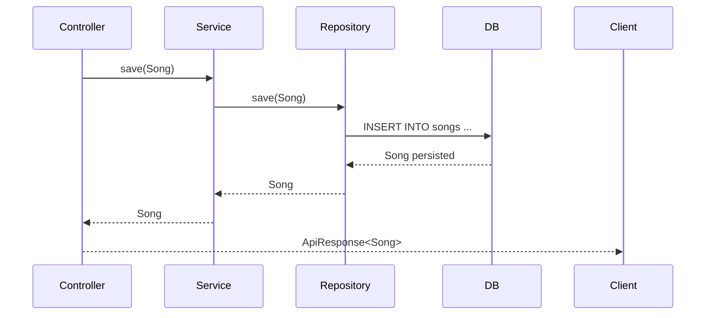

# Génériques
---

## 🧠 1️⃣ Définition intuitive

Un **générique** en Java, c’est une **façon de rendre ton code réutilisable, sûr et typé**,
sans répéter le même code pour chaque type d’objet.

➡️ En gros, tu écris une classe, une interface ou une méthode qui **accepte un type comme paramètre**.

---

### Exemple sans générique (old school Java)

```java
List numbers = new ArrayList();
numbers.add(10);
numbers.add("Salut"); // ⚠️ aucun type n'est imposé

int x = (int) numbers.get(0); // ⚠️ besoin de cast -> risque d'erreur
```

### Exemple avec générique ✅

```java
List<Integer> numbers = new ArrayList<>();
numbers.add(10);
// numbers.add("Salut"); ❌ Erreur de compilation

int x = numbers.get(0); // aucun cast nécessaire
```

> 👉 Ici, `<Integer>` est un **paramètre de type** : il dit à Java "cette liste ne contiendra que des entiers".

---

## ⚙️ 2️⃣ Syntaxe générale

### Déclaration

```java
class MaClasseGenerique<T> {
    private T valeur;

    public MaClasseGenerique(T valeur) {
        this.valeur = valeur;
    }

    public T getValeur() {
        return valeur;
    }
}
```

### Utilisation

```java
MaClasseGenerique<String> texte = new MaClasseGenerique<>("Hello");
MaClasseGenerique<Integer> entier = new MaClasseGenerique<>(42);

System.out.println(texte.getValeur()); // "Hello"
System.out.println(entier.getValeur()); // 42
```

> ✅ Tu vois ici que le **type** (`String`, `Integer`, etc.) est choisi à l’instanciation,
> et que le même code marche pour tous les types sans dupliquer la classe.

---

## 🔧 3️⃣ Pourquoi on les utilise

| Avantage                  | Explication                                                                           |
| ------------------------- | ------------------------------------------------------------------------------------- |
| **Sécurité de type**      | Les erreurs de type sont détectées à la compilation (et non à l’exécution).           |
| **Réutilisation du code** | Un même code fonctionne pour plusieurs types (sans copier-coller).                    |
| **Lisibilité accrue**     | Plus besoin de cast ou de vérifier les types à la main.                               |
| **Performance**           | Pas de coût supplémentaire à l’exécution (effacé après compilation = *type erasure*). |

---

## 🧩 4️⃣ Les génériques dans ton code actuel

Tu les utilises déjà partout sans le savoir 👇

```java
List<Playlist> playlists = new ArrayList<>();
Optional<User> result = userRepository.findById(id);
JpaRepository<Song, Long> // <Song, Long> = paramètres génériques
```

| Exemple                     | Signification                                             |
| --------------------------- | --------------------------------------------------------- |
| `List<Playlist>`            | Liste contenant uniquement des `Playlist`                 |
| `Optional<User>`            | Objet contenant peut-être un `User`                       |
| `JpaRepository<Song, Long>` | Repository qui gère des `Song` identifiées par des `Long` |

---

## 🧠 5️⃣ Génériques dans les méthodes

Tu peux rendre **une méthode seule** générique, sans que la classe le soit.

```java
public <T> void afficher(T valeur) {
    System.out.println("Valeur : " + valeur);
}

afficher("Bonjour"); // T = String
afficher(42);        // T = Integer
```

> ⚙️ Ici, le `<T>` est déclaré *avant* le type de retour pour dire "cette méthode est générique".

---

## ⚔️ 6️⃣ Les bornes : restreindre un générique

Tu peux imposer des contraintes avec `extends` (ou `super`).

### Exemple : borne supérieure (`extends`)

```java
public <T extends Number> void afficher(T valeur) {
    System.out.println("Nombre : " + valeur);
}

afficher(3); // ok (Integer)
afficher(3.14); // ok (Double)
// afficher("Texte"); ❌ interdit : String n’hérite pas de Number
```

### Exemple : borne inférieure (`super`)

```java
public void ajouter(List<? super Integer> liste) {
    liste.add(10); // ok
}
```

> `? super Integer` → accepte `Integer` ou un **type parent de Integer** (`Number`, `Object`, etc.)

---

## 🧰 7️⃣ Les wildcards (`?`)

Le `?` représente **un type inconnu**, très utile pour écrire des fonctions plus flexibles.

```java
public void afficherTous(List<?> elements) {
    for (Object e : elements) {
        System.out.println(e);
    }
}
```

➡️ Cela signifie "une liste de *n’importe quel type*".

---

## 🧠 8️⃣ Ce qu’il faut retenir (cheat résumé)

| Syntaxe         | Signification            | Exemple              |
| --------------- | ------------------------ | -------------------- |
| `<T>`           | Type générique           | `class Box<T>`       |
| `<?>`           | Type inconnu             | `List<?>`            |
| `<T extends X>` | T doit hériter de X      | `<T extends Number>` |
| `<T super X>`   | T doit être parent de X  | `<T super Integer>`  |
| `List<T>`       | Liste typée              | `List<User>`         |
| `Optional<T>`   | Valeur typée optionnelle | `Optional<Playlist>` |

---

## 🚀 9️⃣ En contexte Spring / JPA

Tu les vois dans :

```java
public interface JpaRepository<T, ID> extends PagingAndSortingRepository<T, ID>
```

* `T` → le **type de l’entité**
* `ID` → le **type de la clé primaire**

Quand tu écris :

```java
public interface SongRepository extends JpaRepository<Song, Long> {}
```

→ tu spécialises cette interface pour ton entité `Song`, identifiée par un `Long`.

---

## 💡 En résumé

| Tu veux…                                                  | Utiliser…          | Exemple                     |
| --------------------------------------------------------- | ------------------ | --------------------------- |
| Créer une structure réutilisable pour n’importe quel type | `<T>`              | `List<T>`                   |
| Accepter tout type sans savoir lequel                     | `<?>`              | `List<?>`                   |
| Limiter à un type ou ses enfants                          | `<T extends Type>` | `<T extends Number>`        |
| Limiter à un type ou ses parents                          | `<T super Type>`   | `<T super Integer>`         |
| Spécialiser une interface générique (Spring)              | `<T, ID>`          | `JpaRepository<User, Long>` |

---

---

# 🧠 CHEAT-SHEET : GÉNÉRIQUES JAVA

---

## 1️⃣ Définition et principe

| Élément             | Explication                                                                                                                                                                    |
| ------------------- | ------------------------------------------------------------------------------------------------------------------------------------------------------------------------------ |
| **Génériques**      | Permettent de définir des classes, interfaces ou méthodes capables de travailler avec n’importe quel type d’objet tout en garantissant la sécurité de typage à la compilation. |
| **But**             | Réduire la duplication de code, éviter les erreurs de cast, et renforcer la robustesse du typage.                                                                              |
| **Syntaxe de base** | `class ClasseGenerique<T> { ... }` — `<T>` est un **paramètre de type**.                                                                                                       |

### Exemple simple :

```java
class Box<T> {
    private T valeur;

    public void set(T valeur) { this.valeur = valeur; }
    public T get() { return valeur; }
}

Box<String> boiteTexte = new Box<>();
boiteTexte.set("Hello");
String message = boiteTexte.get();
```

> ✅ Un seul code, plusieurs types possibles : `Box<Integer>`, `Box<String>`, `Box<User>`…

---

## 2️⃣ Les génériques dans la bibliothèque standard

Tu les vois **partout** en Java moderne :

```java
List<String> noms = new ArrayList<>();
Optional<User> user = Optional.of(new User());
Map<Integer, String> map = new HashMap<>();
```

| Type générique | Description                                            |
| -------------- | ------------------------------------------------------ |
| `List<T>`      | Liste d’objets du type `T`.                            |
| `Map<K, V>`    | Table clé-valeur (`K` = type clé, `V` = type valeur).  |
| `Optional<T>`  | Objet qui peut contenir ou non une valeur du type `T`. |

---

## 3️⃣ Paramètres de type

| Syntaxe              | Signification                          | Exemple                                  |
| -------------------- | -------------------------------------- | ---------------------------------------- |
| `<T>`                | Type générique simple                  | `class Box<T>`                           |
| `<K, V>`             | Plusieurs types génériques             | `class Map<K, V>`                        |
| `<T extends Number>` | Borne supérieure (hérite de `Number`)  | `T` = `Integer`, `Double`, etc.          |
| `<T super Integer>`  | Borne inférieure (parent de `Integer`) | `T` = `Number`, `Object`                 |
| `<?>`                | Type inconnu (wildcard)                | `List<?>` = liste de n’importe quel type |

---

## 4️⃣ Génériques dans les méthodes

### Déclaration et usage

```java
public <T> void afficher(T valeur) {
    System.out.println(valeur);
}

afficher("Hello"); // T = String
afficher(42);      // T = Integer
```

> Le `<T>` avant le type de retour indique que la méthode est générique.

---

## 5️⃣ Les Wildcards (`?`)

### Syntaxes :

| Syntaxe                  | Signification                       | Exemple                         |
| ------------------------ | ----------------------------------- | ------------------------------- |
| `List<?>`                | Liste de n’importe quel type        | Méthode de lecture uniquement   |
| `List<? extends Number>` | Liste de types héritant de `Number` | `List<Integer>`, `List<Double>` |
| `List<? super Integer>`  | Liste de parents d’`Integer`        | `List<Number>`, `List<Object>`  |

### Exemple pratique :

```java
public void afficherListe(List<?> liste) {
    for (Object element : liste)
        System.out.println(element);
}
```

---

## 6️⃣ Génériques dans Spring Data JPA

Tu les utilises chaque fois que tu déclares un repository :

```java
public interface SongRepository extends JpaRepository<Song, Long> {}
```

| Paramètre | Description                    |
| --------- | ------------------------------ |
| `<Song>`  | Type d’entité gérée            |
| `<Long>`  | Type de la clé primaire (`id`) |

> ⚙️ Le framework instancie automatiquement toutes les méthodes CRUD (`findAll()`, `save()`, `delete()`, etc.)
> pour ton entité `Song`.

---

## 7️⃣ Génériques dans les classes utilitaires

### Exemple : wrapper générique pour API Response

```java
public class ApiResponse<T> {
    private boolean success;
    private T data;
    
    public ApiResponse(boolean success, T data) {
        this.success = success;
        this.data = data;
    }
}
```

```java
ApiResponse<User> userResponse = new ApiResponse<>(true, user);
ApiResponse<List<Song>> songsResponse = new ApiResponse<>(true, songs);
```

> ✅ Réutilisable pour tout type de réponse (`User`, `Song`, `Error`, etc.)

---

## 8️⃣ Génériques avec interfaces et héritage

### Interface générique :

```java
interface Repository<T> {
    void save(T entity);
    T findById(Long id);
}
```

### Implémentation spécifique :

```java
class UserRepository implements Repository<User> {
    // Spécialisation pour User
}
```

> ⚙️ Tu viens de créer ton propre `JpaRepository` maison.

---

## 9️⃣ Type Erasure (⚠️ subtilité Java)

Les types génériques sont **effacés à la compilation** :
→ Ils servent à vérifier les types **à la compilation**, pas à l’exécution.

```java
List<Integer> l1 = new ArrayList<>();
List<String> l2 = new ArrayList<>();

System.out.println(l1.getClass() == l2.getClass()); // true ✅
```

> Le compilateur remplace `T` par `Object` sous le capot,
> mais garde les infos pour le typage statique.

---

## 🔟 Bonnes pratiques (ingénierie logicielle)

| Bonne pratique                               | Explication                                                         |
| -------------------------------------------- | ------------------------------------------------------------------- |
| ✅ Toujours typer tes collections             | `List<User>` plutôt que `List`                                      |
| ✅ Utiliser `<T>` pour factoriser du code     | Crée des classes ou services réutilisables                          |
| ⚠️ Éviter `List<Object>`                     | Préfère `List<?>` pour la lecture                                   |
| ⚙️ Utiliser les bornes (`extends`, `super`)  | Pour restreindre les types valides                                  |
| 🧩 Combine avec SOLID                        | Le “O” (Open/Closed) tire parti des génériques pour l’extensibilité |
| 🧠 Évite les casts inutiles                  | Si tu castes souvent → tes génériques sont mal conçus               |
| 🧱 Combine avec `Optional<T>` et `Stream<T>` | Ça renforce la sûreté et la lisibilité                              |

---

## 🔍 Exemple d’utilisation complète

```java
public class Repository<T> {

    private List<T> store = new ArrayList<>();

    public void save(T element) {
        store.add(element);
    }

    public List<T> findAll() {
        return new ArrayList<>(store);
    }
}
```

```java
Repository<User> userRepo = new Repository<>();
userRepo.save(new User("Pyke", "password"));

Repository<Song> songRepo = new Repository<>();
songRepo.save(new Song("Sonic.mp3"));
```

> ✅ Tu peux maintenant créer **autant de repositories typés que tu veux**,
> avec un seul code source.

---

## ⚔️ Résumé visuel : ce que fait `<T>`

| Ce que tu écris | Ce que ça veut dire          | Exemple                  |
| --------------- | ---------------------------- | ------------------------ |
| `<T>`           | N’importe quel type          | `Box<T>`                 |
| `<K, V>`        | Deux types (clé/valeur)      | `Map<K, V>`              |
| `<T extends X>` | T hérite de X                | `List<? extends Number>` |
| `<T super X>`   | T est parent de X            | `List<? super Integer>`  |
| `<?>`           | Type inconnu                 | `List<?>`                |
| `T...`          | Plusieurs éléments du type T | `List<T>`                |

---

## 🧩 En résumé (à retenir)

> 💬 “Les génériques, c’est la typisation paramétrée.”
>
> * Ils rendent ton code **réutilisable et sûr**.
> * Ils sont omniprésents dans **Spring**, **JPA**, **Collections**, **Streams**, **Optional**, etc.
> * Ils évitent **la duplication de code** et **les erreurs de cast**.
> * Ils participent à la **conception propre, modulaire et extensible (SOLID)**.

---

Parfait Pyke ⚙️🔥
Voici la **page 2** de ta fiche :

> 🎯 **GÉNÉRIQUES AVANCÉS — ORIENTÉS INGÉNIERIE LOGICIELLE & SPRING / JPA**

---

# 🧩 CHEAT-SHEET — GÉNÉRIQUES JAVA (NIVEAU INGÉNIEUR AVANCÉ)

---

## 1️⃣ Repository générique (pattern d’abstraction DAO)

Ce pattern te permet d’avoir **un seul Repository** pour toutes tes entités,
sans réécrire les opérations CRUD à chaque fois.

---

### 🔹 Exemple

```java
import java.util.List;
import java.util.Optional;

public interface GenericRepository<T, ID> {
    T save(T entity);
    Optional<T> findById(ID id);
    List<T> findAll();
    void delete(T entity);
}
```

### 🔹 Implémentation abstraite

```java
import jakarta.persistence.EntityManager;
import jakarta.persistence.PersistenceContext;
import java.util.List;
import java.util.Optional;

public abstract class GenericRepositoryImpl<T, ID> implements GenericRepository<T, ID> {

    @PersistenceContext
    protected EntityManager entityManager;

    private final Class<T> entityClass;

    protected GenericRepositoryImpl(Class<T> entityClass) {
        this.entityClass = entityClass;
    }

    @Override
    public T save(T entity) {
        entityManager.persist(entity);
        return entity;
    }

    @Override
    public Optional<T> findById(ID id) {
        return Optional.ofNullable(entityManager.find(entityClass, id));
    }

    @Override
    public List<T> findAll() {
        return entityManager.createQuery("FROM " + entityClass.getName(), entityClass).getResultList();
    }

    @Override
    public void delete(T entity) {
        entityManager.remove(entity);
    }
}
```

### 🔹 Spécialisation pour `Song`

```java
@Repository
public class SongRepositoryImpl extends GenericRepositoryImpl<Song, Long> {
    public SongRepositoryImpl() {
        super(Song.class);
    }
}
```

> ✅ Tu factorises toute la logique CRUD,
> et tu ne changes que la classe métier (`Song`, `User`, `Playlist`, etc.)

---

## 2️⃣ Service générique

Pattern courant dans **Spring Boot** : un service métier qui agit sur n’importe quelle entité.

---

### 🔹 Interface générique

```java
public interface GenericService<T, ID> {
    T create(T entity);
    Optional<T> read(ID id);
    List<T> readAll();
    T update(T entity);
    void delete(ID id);
}
```

### 🔹 Implémentation générique

```java
public abstract class GenericServiceImpl<T, ID> implements GenericService<T, ID> {

    protected final GenericRepository<T, ID> repository;

    protected GenericServiceImpl(GenericRepository<T, ID> repository) {
        this.repository = repository;
    }

    @Override
    public T create(T entity) {
        return repository.save(entity);
    }

    @Override
    public Optional<T> read(ID id) {
        return repository.findById(id);
    }

    @Override
    public List<T> readAll() {
        return repository.findAll();
    }

    @Override
    public T update(T entity) {
        return repository.save(entity);
    }

    @Override
    public void delete(ID id) {
        repository.findById(id).ifPresent(repository::delete);
    }
}
```

### 🔹 Spécialisation pour `UserService`

```java
@Service
public class UserServiceImpl extends GenericServiceImpl<User, Long> {
    public UserServiceImpl(UserRepository repository) {
        super(repository);
    }
}
```

> ⚙️ Ce modèle t’offre une **architecture en couches propre et factorisée**.
> Chaque entité hérite du comportement CRUD sans duplication.

---

## 3️⃣ DTO et API Response génériques

Très utile dans les APIs REST :
un même modèle de réponse pour toutes les entités.

---

### 🔹 Classe générique

```java
public class ApiResponse<T> {
    private boolean success;
    private String message;
    private T data;

    public ApiResponse(boolean success, String message, T data) {
        this.success = success;
        this.message = message;
        this.data = data;
    }

    public static <T> ApiResponse<T> ok(T data) {
        return new ApiResponse<>(true, "OK", data);
    }

    public static <T> ApiResponse<T> error(String message) {
        return new ApiResponse<>(false, message, null);
    }
}
```

### 🔹 Exemple d’utilisation

```java
@GetMapping("/{id}")
public ResponseEntity<ApiResponse<User>> getUser(@PathVariable Long id) {
    return userService.read(id)
        .map(user -> ResponseEntity.ok(ApiResponse.ok(user)))
        .orElseGet(() -> ResponseEntity.status(404).body(ApiResponse.error("User not found")));
}
```

> ✅ Un seul format pour toutes tes entités et endpoints (`Song`, `Playlist`, etc.)

---

## 4️⃣ Factory Pattern + Génériques

### 🔹 Exemple simple

```java
public class EntityFactory<T> {

    private final Supplier<T> constructor;

    public EntityFactory(Supplier<T> constructor) {
        this.constructor = constructor;
    }

    public T create() {
        return constructor.get();
    }
}
```

### 🔹 Usage :

```java
EntityFactory<User> userFactory = new EntityFactory<>(() -> new User("Pyke", "pass"));
User user = userFactory.create();
```

> ⚙️ Ce pattern t’évite les `new` répétitifs,
> et permet des instanciations propres dans les tests ou builder complexes.

---

## 5️⃣ Builder Pattern (avec génériques imbriqués)

Très utilisé pour **les entités immuables** ou complexes.

### 🔹 Exemple :

```java
public class Song {
    private final Long id;
    private final String title;

    private Song(Builder builder) {
        this.id = builder.id;
        this.title = builder.title;
    }

    public static class Builder {
        private Long id;
        private String title;

        public Builder id(Long id) {
            this.id = id;
            return this;
        }

        public Builder title(String title) {
            this.title = title;
            return this;
        }

        public Song build() {
            return new Song(this);
        }
    }
}
```

### 🔹 Utilisation

```java
Song s = new Song.Builder()
    .title("Sonic.mp3")
    .id(1L)
    .build();
```

> ✅ Fluent interface + immutabilité + typage sûr.

---

## 6️⃣ Combinaison avec SOLID & Clean Architecture

| Principe                      | Rôle des génériques                                                                                           |
| ----------------------------- | ------------------------------------------------------------------------------------------------------------- |
| **S — Single Responsibility** | Un repository/service générique a une seule responsabilité : gérer les entités.                               |
| **O — Open/Closed**           | Tu peux étendre le comportement pour une entité spécifique sans modifier le code commun.                      |
| **L — Liskov Substitution**   | Les classes spécialisées (`UserRepository`, `SongRepository`) remplacent sans casser la logique.              |
| **I — Interface Segregation** | Chaque interface générique définit un contrat minimal (CRUD, Query, etc.)                                     |
| **D — Dependency Inversion**  | Les services dépendent des abstractions génériques (`GenericRepository<T, ID>`) plutôt que d’implémentations. |

---

## 7️⃣ Génériques et Tests unitaires

### 🔹 Exemple avec Mockito

```java
@Mock
private GenericRepository<User, Long> userRepo;

@InjectMocks
private GenericServiceImpl<User, Long> userService;

@Test
void testCreateUser() {
    User user = new User("Pyke", "1234");
    when(userRepo.save(any(User.class))).thenReturn(user);

    User result = userService.create(user);

    assertThat(result.getUsername()).isEqualTo("Pyke");
}
```

> ✅ Tu peux tester **n’importe quel service ou repository** générique sans duplication.

---

## 8️⃣ Cas réels dans ton projet (Music Server)

| Composant                        | Type générique recommandé                 |
| -------------------------------- | ----------------------------------------- |
| `JpaRepository<Song, Long>`      | Déjà un générique Spring                  |
| `GenericService<Playlist, Long>` | Pour factoriser CRUD des playlists        |
| `ApiResponse<T>`                 | Pour uniformiser toutes les réponses REST |
| `EntityFactory<T>`               | Pour tests et création d’objets par type  |
| `Optional<T>`                    | Pour gestion élégante des valeurs null    |
| `List<T>`                        | Pour toutes les relations @OneToMany      |

---

## 🧱 À retenir

| Concept                  | Utilité clé                       |
| ------------------------ | --------------------------------- |
| **Classe générique**     | Réutilisable pour plusieurs types |
| **Méthode générique**    | Paramètre typé à la volée         |
| **Repository générique** | CRUD factorisé                    |
| **Service générique**    | Logique business commune          |
| **DTO générique**        | Réponse API uniforme              |
| **Factory + Builder**    | Création contrôlée d’objets       |
| **Wildcards et bornes**  | Flexibilité maîtrisée du typage   |

---

Excellent 🔥 Pyke, voici ta **page 3** — celle que peu d’ingénieurs maîtrisent bien :

> ⚙️ **Comparer Génériques, Héritage, Interfaces Abstraites et Patterns de Factorisation.**
> C’est ce qui te permet de **choisir la bonne abstraction** selon la nature du problème (niveau architecte).

---

# 🧠 CHEAT-SHEET — CHOISIR ENTRE GÉNÉRIQUES, HÉRITAGE ET INTERFACES

---

## 1️⃣ Vision d’ensemble

| Concept                  | Objectif                                               | Usage typique                              | Avantage clé                                    | Danger si mal utilisé                     |
| ------------------------ | ------------------------------------------------------ | ------------------------------------------ | ----------------------------------------------- | ----------------------------------------- |
| **Génériques (`<T>`)**   | Factoriser la logique commune *indépendamment du type* | Repository, Service, DTO, Factory          | Typage fort et réutilisabilité sans duplication | Complexité syntaxique, effacement de type |
| **Héritage (`extends`)** | Factoriser via hiérarchie de classes                   | Modèles métiers proches (User → AdminUser) | Réutilisation + polymorphisme                   | Couplage fort, rigidité                   |
| **Interface**            | Définir un contrat sans implémentation                 | Repositories, Services, Controllers        | Découplage total, testabilité                   | Trop d’interfaces = surcharge inutile     |
| **Classe abstraite**     | Mi-chemin entre interface et héritage                  | Base commune pour services ou entités      | Code commun + extensibilité                     | Bloque héritage multiple                  |
| **Composition**          | Assembler des comportements                            | Entités riches ou services réutilisables   | Flexibilité maximale                            | Nécessite une bonne conception            |

---

## 2️⃣ 🎯 Quand utiliser un **générique**

### ✅ Cas idéal :

* Plusieurs entités différentes partagent le **même comportement** (CRUD, validation, transformation…).
* Tu veux **un seul code source**, mais typé différemment selon l’entité.

```java
public class GenericRepository<T> {
    private final List<T> store = new ArrayList<>();

    public void save(T element) { store.add(element); }
    public List<T> findAll() { return new ArrayList<>(store); }
}
```

```java
GenericRepository<User> users = new GenericRepository<>();
GenericRepository<Song> songs = new GenericRepository<>();
```

✅ **Exemples dans ton projet :**

* `JpaRepository<Song, Long>`
* `GenericService<Playlist, Long>`
* `ApiResponse<T>`

> 🧠 Les génériques sont un **outil d’ingénierie logicielle**, pas un outil métier.

---

## 3️⃣ 🧩 Quand utiliser **l’héritage (extends)**

### ✅ Cas idéal :

* Les entités ont une **vraie relation “est un(e)” (is-a)**.
* Tu veux **hériter de propriétés + comportements**.

### Exemple :

```java
@Entity
@Inheritance(strategy = InheritanceType.JOINED)
public abstract class Media {
    @Id private Long id;
    private String title;
}

@Entity
public class Song extends Media {
    private String filePath;
}

@Entity
public class Podcast extends Media {
    private int duration;
}
```

> ✅ Ici, `Song` *est un* `Media`, donc héritage légitime.

### ⚠️ Mauvais usage :

* Hériter juste pour **réutiliser du code** (→ préfère la composition ou les génériques).
* Héritage profond (3+ niveaux) → rigidité et couplage fort.

> ⚙️ L’héritage exprime un **concept du domaine**, pas une astuce de code.

---

## 4️⃣ ⚡ Quand utiliser une **interface**

### ✅ Cas idéal :

* Tu veux définir un **contrat** (ensemble de comportements).
* Tu veux permettre **plusieurs implémentations interchangeables**.

```java
public interface MusicService {
    void play(String song);
    void pause();
}
```

```java
public class SpotifyService implements MusicService {
    public void play(String song) { ... }
    public void pause() { ... }
}
```

> ✅ Tu peux remplacer `SpotifyService` par `LocalPlayerService` sans changer le reste du code.

### 💡 Interfaces + Génériques

```java
public interface Repository<T> {
    void save(T entity);
    List<T> findAll();
}
```

→ Tu combines **contrat + flexibilité typée**.

---

## 5️⃣ 🧱 Quand utiliser une **classe abstraite**

### ✅ Cas idéal :

* Tu veux **un comportement commun** pour plusieurs sous-classes.
* Tu veux **empêcher l’instanciation directe**.

```java
public abstract class BaseService<T> {
    public void logSave(T entity) {
        System.out.println("Saving " + entity);
    }

    public abstract void save(T entity);
}
```

```java
public class SongService extends BaseService<Song> {
    public void save(Song song) { /* impl spécifique */ }
}
```

> ⚙️ La classe abstraite est souvent le **pont** entre héritage et génériques :
>
> * Code commun factorisé
> * Mais extensible via types concrets

---

## 6️⃣ 🧩 Comparatif concret : Repository

| Approche      | Exemple                                     | Avantage                 | Inconvénient                 |
| ------------- | ------------------------------------------- | ------------------------ | ---------------------------- |
| **Héritage**  | `class SongRepo extends BaseRepo {}`        | Code commun hérité       | Pas flexible entre types     |
| **Interface** | `interface SongRepo extends CrudRepo<Song>` | Contrat clair            | Implémentation manuelle      |
| **Générique** | `class GenericRepo<T>`                      | Réutilisable, typé       | Complexité syntaxique        |
| **Abstraite** | `abstract class BaseRepo<T>`                | Code commun + extensible | 1 seule superclasse possible |

---

## 7️⃣ 🎛️ Combinaison des patterns (niveau architecte)

### 🔹 Exemple : Architecture propre de service JPA

```java
public interface CrudService<T, ID> {
    T save(T entity);
    Optional<T> findById(ID id);
    void delete(T entity);
}
```

```java
public abstract class AbstractCrudService<T, ID> implements CrudService<T, ID> {
    @PersistenceContext protected EntityManager em;
    private final Class<T> type;

    protected AbstractCrudService(Class<T> type) {
        this.type = type;
    }

    public T save(T entity) { em.persist(entity); return entity; }
    public Optional<T> findById(ID id) { return Optional.ofNullable(em.find(type, id)); }
}
```

```java
@Service
public class SongService extends AbstractCrudService<Song, Long> {
    public SongService() { super(Song.class); }
}
```

> ✅ Ici tu combines :
> Interface (contrat) + Classe abstraite (logique commune) + Génériques (flexibilité typée)

---

## 8️⃣ 🧠 Comment choisir ? (guide rapide)

| Situation                                                                  | Recommandation                             |
| -------------------------------------------------------------------------- | ------------------------------------------ |
| Plusieurs entités partagent une logique identique mais de types différents | 👉 **Génériques (`<T>`)**                  |
| Une entité *est une* autre entité (relation hiérarchique claire)           | 👉 **Héritage (`extends`)**                |
| Tu veux définir un contrat métier interchangeable                          | 👉 **Interface (`interface`)**             |
| Tu veux factoriser du code concret tout en forçant la spécialisation       | 👉 **Classe abstraite (`abstract class`)** |
| Tu veux assembler plusieurs comportements sans héritage multiple           | 👉 **Composition (injection, services)**   |

---

## 9️⃣ Exemple résumé : ton projet Music Server

| Élément                              | Type d’abstraction               | Justification                          |
| ------------------------------------ | -------------------------------- | -------------------------------------- |
| `JpaRepository<Song, Long>`          | **Générique**                    | CRUD factorisé pour chaque entité      |
| `Playlist` hérite de `Media` (futur) | **Héritage**                     | Relation *is-a* logique                |
| `UserService`, `SongService`         | **Interface + Implémentation**   | Contrat métier interchangeable         |
| `AbstractCrudService<T, ID>`         | **Classe abstraite + Générique** | Code commun pour tous les services     |
| `PlaylistItem` qui référence `Song`  | **Composition**                  | Relation *has-a* (possède une chanson) |

---

## 🔟 🧩 À retenir (vision ingénieur logiciel)

| Concept              | But principal                            | Exemple dans ton app                     |
| -------------------- | ---------------------------------------- | ---------------------------------------- |
| **Génériques**       | Réutiliser le code sans dépendre du type | `GenericService<T, ID>`                  |
| **Héritage**         | Décrire une hiérarchie métier            | `Media → Song / Playlist`                |
| **Interface**        | Définir des contrats modulaires          | `Repository<T>`                          |
| **Classe abstraite** | Centraliser du code réutilisable         | `AbstractCrudService<T>`                 |
| **Composition**      | Combiner plusieurs comportements         | `Playlist` contient `List<PlaylistItem>` |

---

## ⚙️ Bonus : Bonnes pratiques

✅ Utilise **héritage** pour la sémantique “is-a”.
✅ Utilise **composition** pour la sémantique “has-a”.
✅ Utilise **génériques** pour la réutilisation typée.
✅ Utilise **interfaces** pour le polymorphisme comportemental.
✅ Combine les trois pour respecter **SOLID** et **Open/Closed**.

---


---

# ⚙️ CLEAN ARCHITECTURE — GÉNÉRIQUES, HÉRITAGE ET INTERFACES EN ACTION

*(Cas concret : Music Server)*

---

## 🧩 1️⃣ Vision d’ensemble — Structure du projet

```
src/main/java/com/music_server/mvp/
│
├── domain/                → Entités métiers (User, Song, Playlist, PlaylistItem)
├── repository/            → Interfaces JPA + GenericRepository<T, ID>
├── service/               → Services métier (UserService, PlaylistService, etc.)
├── controller/            → Endpoints REST (UserController, SongController, etc.)
└── dto/                   → Objets de transfert de données (ApiResponse<T>, etc.)
```

> Chaque couche **ne dépend que des abstractions de la couche du dessous.**
> C’est le principe clé de **Clean Architecture + D.I. (Dependency Inversion).**

---

## 🧱 2️⃣ Domain Layer (modèle métier pur)

💡 **Pas de dépendance à Spring ni JPA si possible**
→ Juste les annotations `@Entity`, `@Id` nécessaires pour persister.

```java
@Entity
@Table(name = "songs")
public class Song {
    @Id @GeneratedValue(strategy = GenerationType.IDENTITY)
    private Long id;
    private String title;
    private String filePath;

    @ManyToOne(fetch = FetchType.LAZY)
    @JoinColumn(name = "user_id")
    private User owner;
}
```

> 🧠 Le domaine reste simple : **un POJO métier pur** avec logique minimale.

---

## 🧩 3️⃣ Repository Layer (accès aux données)

### 🔹 Interface générique (abstraction commune)

```java
@NoRepositoryBean
public interface GenericRepository<T, ID> extends JpaRepository<T, ID> {
    // Tu peux ajouter des méthodes communes (ex: soft delete, audit, etc.)
}
```

### 🔹 Repositories spécifiques (héritent du générique)

```java
@Repository
public interface SongRepository extends GenericRepository<Song, Long> {
    List<Song> findByOwnerId(Long userId);
}
```

```java
@Repository
public interface PlaylistRepository extends GenericRepository<Playlist, Long> {
    List<Playlist> findByCreatorUsername(String username);
}
```

> ✅ JPA gère le typage via les **génériques** de manière native.

---

## ⚙️ 4️⃣ Service Layer (logique métier)

### 🔹 Interface générique

```java
public interface GenericService<T, ID> {
    T save(T entity);
    Optional<T> findById(ID id);
    List<T> findAll();
    void deleteById(ID id);
}
```

### 🔹 Implémentation abstraite (factorisation)

```java
@Transactional
public abstract class AbstractGenericService<T, ID> implements GenericService<T, ID> {

    protected final GenericRepository<T, ID> repository;

    protected AbstractGenericService(GenericRepository<T, ID> repository) {
        this.repository = repository;
    }

    @Override
    public T save(T entity) { return repository.save(entity); }

    @Override
    public Optional<T> findById(ID id) { return repository.findById(id); }

    @Override
    public List<T> findAll() { return repository.findAll(); }

    @Override
    public void deleteById(ID id) { repository.deleteById(id); }
}
```

### 🔹 Services concrets

```java
@Service
public class SongService extends AbstractGenericService<Song, Long> {

    public SongService(SongRepository repository) {
        super(repository);
    }

    public List<Song> findByUser(Long userId) {
        return ((SongRepository) repository).findByOwnerId(userId);
    }
}
```

```java
@Service
public class PlaylistService extends AbstractGenericService<Playlist, Long> {
    public PlaylistService(PlaylistRepository repository) {
        super(repository);
    }
}
```

> 🧠 Ce pattern te permet d’ajouter de nouvelles entités en 2 fichiers
> → une entité + un repository, sans jamais toucher au reste du code.

---

## 🧩 5️⃣ DTO Layer (API / Front Communication)

### 🔹 ApiResponse générique

```java
public class ApiResponse<T> {
    private boolean success;
    private String message;
    private T data;

    public ApiResponse(boolean success, String message, T data) {
        this.success = success;
        this.message = message;
        this.data = data;
    }

    public static <T> ApiResponse<T> ok(T data) {
        return new ApiResponse<>(true, "OK", data);
    }

    public static <T> ApiResponse<T> error(String msg) {
        return new ApiResponse<>(false, msg, null);
    }
}
```

> ✅ Tu réutilises ce même objet pour **toutes les routes de ton API REST**.

---

## 🌐 6️⃣ Controller Layer (interface REST)

### 🔹 Exemple : SongController

```java
@RestController
@RequestMapping("/api/songs")
public class SongController {

    private final SongService songService;

    public SongController(SongService songService) {
        this.songService = songService;
    }

    @GetMapping
    public ResponseEntity<ApiResponse<List<Song>>> getAllSongs() {
        return ResponseEntity.ok(ApiResponse.ok(songService.findAll()));
    }

    @GetMapping("/{id}")
    public ResponseEntity<ApiResponse<Song>> getSongById(@PathVariable Long id) {
        return songService.findById(id)
                .map(song -> ResponseEntity.ok(ApiResponse.ok(song)))
                .orElseGet(() -> ResponseEntity.status(404).body(ApiResponse.error("Song not found")));
    }

    @PostMapping
    public ResponseEntity<ApiResponse<Song>> createSong(@RequestBody Song song) {
        return ResponseEntity.ok(ApiResponse.ok(songService.save(song)));
    }

    @DeleteMapping("/{id}")
    public ResponseEntity<ApiResponse<Void>> deleteSong(@PathVariable Long id) {
        songService.deleteById(id);
        return ResponseEntity.ok(ApiResponse.ok(null));
    }
}
```

> 🧠 Ici, la logique REST est minimaliste :
> le **controller ne fait que déléguer** au service générique.

---

## 🔄 7️⃣ Cycle complet : du Controller au Domain



> 🧱 Chaque couche ne connaît que la suivante → découplage total.

---

## 🧠 8️⃣ Exemple : extension future

Demain, tu veux gérer des **Podcasts** 🎙️

→ Tu ajoutes juste :

```java
@Entity
public class Podcast extends Media { ... }

@Repository
public interface PodcastRepository extends GenericRepository<Podcast, Long> {}

@Service
public class PodcastService extends AbstractGenericService<Podcast, Long> {
    public PodcastService(PodcastRepository repository) { super(repository); }
}
```

> ✅ Aucun changement ailleurs dans ton app.
> La logique générique fait tout le reste.

---

## 🧩 9️⃣ Bonus : règles d’or Clean Architecture

| Règle                                             | Signification                              | Exemple |
| ------------------------------------------------- | ------------------------------------------ | ------- |
| **Les dépendances vont du haut vers le bas.**     | Controller → Service → Repository → Domain | ✅       |
| **Les couches ne se connaissent pas entre elles** | Controller ne connaît pas JPA              | ✅       |
| **Injection de dépendance obligatoire**           | Via constructeur (pas `@Autowired` direct) | ✅       |
| **Code métier dans le domain/service uniquement** | Pas de logique dans le controller          | ✅       |
| **Repository = “plomberie” uniquement**           | Aucune règle métier ici                    | ✅       |

---

## 🔟 Résumé final — les 4 concepts combinés

| Concept              | Exemple concret                                             | But dans l’architecture              |
| -------------------- | ----------------------------------------------------------- | ------------------------------------ |
| **Génériques**       | `GenericRepository<T, ID>`, `AbstractGenericService<T, ID>` | Réutilisation typée et factorisation |
| **Héritage**         | `Playlist extends Media`                                    | Hiérarchie métier                    |
| **Interface**        | `GenericService<T, ID>`                                     | Contrat d’abstraction                |
| **Classe abstraite** | `AbstractGenericService<T, ID>`                             | Logique commune factorisée           |
| **Composition**      | `Playlist` contient `List<PlaylistItem>`                    | Agrégation métier                    |

---

## 🚀 À retenir

> **“Une bonne architecture n’est pas celle qui fait beaucoup,
> mais celle qui permet de tout faire sans tout casser.”**

✅ Tes entités sont isolées
✅ Tes services sont factorisés
✅ Tes contrôleurs sont minces
✅ Tes tests peuvent se moquer de tout facilement
✅ Tes extensions sont triviales

---


**Page 5 : Les Tests Unitaires et d’Intégration dans une Architecture Clean (Music Server Edition)**

Ici, tu vas comprendre **comment tester proprement chaque couche** (Domain, Repository, Service, Controller)
→ avec **JUnit 5, Mockito et Spring Boot Test**, dans une architecture **claire, modulaire et réutilisable**.

---

# 🧪 CLEAN TESTING ARCHITECTURE — SPRING + JPA + MOCKITO

---

## 🧩 1️⃣ Types de tests à connaître

| Type                           | Cible                                                             | Objectif                                    | Outils                    |
| ------------------------------ | ----------------------------------------------------------------- | ------------------------------------------- | ------------------------- |
| **Test Unitaire**              | Une classe isolée (ex: `SongService`)                             | Vérifie le comportement logique pur         | JUnit 5 + Mockito         |
| **Test d’Intégration**         | Plusieurs composants Spring ensemble (ex: Service + Repo + DB H2) | Vérifie l’intégration réelle                | `@SpringBootTest` + DB H2 |
| **Test de Contrôleur (API)**   | Les endpoints REST                                                | Vérifie les routes HTTP et la sérialisation | `@WebMvcTest` + MockMvc   |
| **Test de bout en bout (E2E)** | L’application complète                                            | Vérifie le flow complet du client au DB     | RestAssured / Postman     |

> ⚙️ En Clean Architecture, chaque couche est testée **indépendamment**, puis **enchaînée** pour les intégrations.

---

## 🧱 2️⃣ Test Unitaire : Service (avec Mockito)

💡 But : tester la **logique métier** sans la base de données.

---

### 🔹 Exemple : `SongServiceTests.java`

```java
@ExtendWith(MockitoExtension.class)
class SongServiceTests {

    @Mock
    private SongRepository songRepository;

    @InjectMocks
    private SongService songService;

    @Test
    void testCreateSong() {
        User owner = new User("Pyke", "pass");
        Song song = new Song("Sonic.mp3", owner);

        when(songRepository.save(any(Song.class))).thenReturn(song);

        Song saved = songService.save(song);

        assertThat(saved.getTitle()).isEqualTo("Sonic.mp3");
        verify(songRepository).save(song);
    }

    @Test
    void testFindSongById() {
        Song song = new Song(1L, "Mario.mp3", null);
        when(songRepository.findById(1L)).thenReturn(Optional.of(song));

        Optional<Song> result = songService.findById(1L);

        assertThat(result).isPresent();
        assertThat(result.get().getTitle()).isEqualTo("Mario.mp3");
    }
}
```

> ✅ Le **Repository est mocké**, donc pas de DB.
> Tu testes **le comportement du service uniquement**.

---

## ⚙️ 3️⃣ Test d’Intégration : Repository + DB H2

💡 But : s’assurer que **les requêtes SQL/JPA** fonctionnent vraiment.

---

### 🔹 Exemple : `SongRepositoryIntegrationTests.java`

```java
@SpringBootTest
@Transactional
@DirtiesContext(classMode = DirtiesContext.ClassMode.AFTER_EACH_TEST_METHOD)
class SongRepositoryIntegrationTests {

    @Autowired
    private SongRepository songRepository;

    @Test
    void testSaveAndFindSong() {
        Song song = new Song("Sonic.mp3", new User("Pyke", "pass"));
        songRepository.save(song);

        Optional<Song> result = songRepository.findById(song.getId());
        assertThat(result).isPresent();
        assertThat(result.get().getTitle()).isEqualTo("Sonic.mp3");
    }

    @Test
    void testFindAllSongs() {
        songRepository.save(new Song("Chill.mp3", new User("Pyke", "pass")));
        songRepository.save(new Song("Sport.mp3", new User("Kyde", "pass")));

        List<Song> songs = songRepository.findAll();
        assertThat(songs).hasSize(2);
    }
}
```

> ✅ Utilise la base **H2 in-memory**
> ✅ Nettoyage automatique après chaque test (`@DirtiesContext`)
> ✅ Transactions rollbackées grâce à `@Transactional`

---

## 🌐 4️⃣ Test du Controller (MockMvc)

💡 But : simuler des **appels HTTP REST**
→ sans vraiment lancer le serveur.

---

### 🔹 Exemple : `SongControllerTests.java`

```java
@WebMvcTest(SongController.class)
@AutoConfigureMockMvc
class SongControllerTests {

    @Autowired
    private MockMvc mockMvc;

    @MockBean
    private SongService songService;

    @Test
    void testGetAllSongs() throws Exception {
        List<Song> songs = List.of(new Song("Chill.mp3", null));
        when(songService.findAll()).thenReturn(songs);

        mockMvc.perform(get("/api/songs"))
            .andExpect(status().isOk())
            .andExpect(jsonPath("$.data[0].title").value("Chill.mp3"));
    }

    @Test
    void testGetSongById_NotFound() throws Exception {
        when(songService.findById(99L)).thenReturn(Optional.empty());

        mockMvc.perform(get("/api/songs/99"))
            .andExpect(status().isNotFound())
            .andExpect(jsonPath("$.message").value("Song not found"));
    }
}
```

> ✅ `MockMvc` permet de tester sans serveur HTTP réel.
> ✅ `@MockBean` injecte un faux service dans le contrôleur.
> ✅ Idéal pour tester les endpoints REST et la sérialisation JSON.

---

## 🧠 5️⃣ Test de flux complet (Integration End-to-End)

💡 But : vérifier le **cycle complet** :
Controller → Service → Repository → DB → retour API

---

### 🔹 Exemple : `SongFullFlowIntegrationTests.java`

```java
@SpringBootTest(webEnvironment = SpringBootTest.WebEnvironment.RANDOM_PORT)
@AutoConfigureMockMvc
class SongFullFlowIntegrationTests {

    @Autowired
    private MockMvc mockMvc;

    @Test
    void testFullSongLifecycle() throws Exception {
        // Création d'une chanson
        mockMvc.perform(post("/api/songs")
                .contentType(MediaType.APPLICATION_JSON)
                .content("{\"title\":\"Sonic.mp3\"}"))
            .andExpect(status().isOk())
            .andExpect(jsonPath("$.data.title").value("Sonic.mp3"));

        // Lecture de toutes les chansons
        mockMvc.perform(get("/api/songs"))
            .andExpect(status().isOk())
            .andExpect(jsonPath("$.data[0].title").value("Sonic.mp3"));
    }
}
```

> ✅ Tu testes la **chaîne complète**
> ✅ Avec la DB H2 réelle + JSON + REST + sérialisation Spring

---

## 🔍 6️⃣ Organisation idéale de tes tests

```
src/test/java/com/music_server/mvp/
│
├── domain/                  # (rare) tests sur la logique pure
├── repository/
│   ├── UserRepositoryTests.java
│   ├── SongRepositoryTests.java
│   └── PlaylistRepositoryTests.java
├── service/
│   ├── UserServiceTests.java
│   ├── SongServiceTests.java
│   └── PlaylistServiceTests.java
└── controller/
    ├── UserControllerTests.java
    ├── SongControllerTests.java
    └── PlaylistControllerTests.java
```

> ✅ Garde chaque couche indépendante
> ✅ Tu peux lancer les tests d’une seule couche (utile pour CI/CD)

---

## 🧠 7️⃣ Bonnes pratiques avancées

| Type de test    | Bonne pratique                     | Mauvaise pratique     |
| --------------- | ---------------------------------- | --------------------- |
| **Unitaire**    | Mock tout sauf la classe testée    | Accès à la DB         |
| **Intégration** | DB réelle (H2 ou TestContainers)   | Mock partiels         |
| **Controller**  | Mock service, pas repo             | Tester la DB ici      |
| **E2E**         | Simuler le vrai cycle HTTP         | Mock inutile          |
| **Tous types**  | Assertions explicites avec AssertJ | `assertTrue()` vagues |

---

## 🧩 8️⃣ Astuce : Générique de tests (pattern avancé)

Tu peux factoriser tes tests de CRUD pour toutes tes entités :

```java
public abstract class GenericRepositoryTest<T> {
    protected abstract GenericRepository<T, Long> getRepository();
    protected abstract T createEntity();

    @Test
    void testSaveAndFind() {
        T entity = createEntity();
        getRepository().save(entity);
        assertThat(getRepository().findAll()).isNotEmpty();
    }
}
```

Puis tu fais :

```java
class SongRepositoryTest extends GenericRepositoryTest<Song> {
    @Autowired private SongRepository repo;
    @Override protected GenericRepository<Song, Long> getRepository() { return repo; }
    @Override protected Song createEntity() { return new Song("Test.mp3", new User("Pyke", "pass")); }
}
```

> ✅ TDD “pro” : un seul test parent pour tout ton CRUD,
> et chaque entité n’a qu’à le spécialiser.

---

## ⚙️ 9️⃣ Intégration dans ta CI/CD (GitHub Actions)

Ajoute ceci à ton workflow :

```yaml
- name: Run tests
  run: mvn clean test
```

> ✅ Tous les tests (`unit + integration`) seront exécutés automatiquement à chaque commit.

---

## 🚀 10️⃣ Résumé final

| Couche     | Type de test         | Annotation clé                                  | Objectif                    |
| ---------- | -------------------- | ----------------------------------------------- | --------------------------- |
| Domain     | Unitaire             | —                                               | Vérifier la logique interne |
| Repository | Intégration          | `@SpringBootTest`, `@Transactional`             | Vérifier les accès DB       |
| Service    | Unitaire             | `@ExtendWith(MockitoExtension.class)`           | Tester la logique métier    |
| Controller | MockMvc              | `@WebMvcTest`                                   | Tester les routes et JSON   |
| E2E        | Intégration complète | `@SpringBootTest(webEnvironment = RANDOM_PORT)` | Tester le flux global       |

---

## 🧠 Citation d’ingénieur

> “Le test parfait ne s’assure pas que le code fonctionne,
> il s’assure qu’il *ne pourra plus casser sans qu’on le voie venir.*”
> — *Principle of Defensive Software Design*

---

**Page 6 : Tests d’intégration réalistes avec Testcontainers (PostgreSQL, Docker, Spring Boot)**

> Cette page te montre comment passer d’une DB **in-memory (H2)** à une **vraie instance PostgreSQL Dockerisée**,
> entièrement contrôlée par ton code de test.
> 👉 C’est la méthode utilisée par les ingénieurs backend seniors en entreprise pour tester la *vraie intégration* sans dépendre d’un serveur externe.

---

# 🧪 PAGE 6 — INTÉGRATION SPRING + TESTCONTAINERS + POSTGRESQL

*(Version Production-ready pour ton Music Server)*

---

## 🧩 1️⃣ Pourquoi Testcontainers ?

### 💡 Problème avec H2 :

* Comportement SQL différent de PostgreSQL (ex : séquences, JSONB, index GIN, etc.)
* Hibernate génère un SQL compatible H2 mais pas PostgreSQL
* Tests passent en local, puis échouent en production 😬

### ✅ Solution : Testcontainers

* Lance **PostgreSQL dans un conteneur Docker temporaire**
* Chaque test dispose de **sa propre instance isolée**
* Base de données 100% conforme à ta prod
* Se détruit automatiquement à la fin

---

## 🧱 2️⃣ Dépendances Maven

Ajoute ceci à ton `pom.xml` :

```xml
<dependency>
    <groupId>org.testcontainers</groupId>
    <artifactId>junit-jupiter</artifactId>
    <version>1.20.2</version>
    <scope>test</scope>
</dependency>

<dependency>
    <groupId>org.testcontainers</groupId>
    <artifactId>postgresql</artifactId>
    <version>1.20.2</version>
    <scope>test</scope>
</dependency>
```

> 🔥 Spring Boot détecte automatiquement Testcontainers à partir de `spring.datasource.url`.

---

## ⚙️ 3️⃣ Classe de configuration globale pour les tests

> On crée une **classe d’initialisation générique** que tous tes tests vont étendre.

```java
package com.music_server.mvp.config;

import org.springframework.boot.test.context.SpringBootTest;
import org.springframework.test.context.DynamicPropertyRegistry;
import org.springframework.test.context.DynamicPropertySource;
import org.testcontainers.containers.PostgreSQLContainer;
import org.testcontainers.junit.jupiter.Container;
import org.testcontainers.junit.jupiter.Testcontainers;

@Testcontainers
@SpringBootTest
public abstract class AbstractIntegrationTest {

    @Container
    private static final PostgreSQLContainer<?> postgres =
        new PostgreSQLContainer<>("postgres:15-alpine")
            .withDatabaseName("musicdb_test")
            .withUsername("testuser")
            .withPassword("testpass");

    @DynamicPropertySource
    static void registerPostgresProperties(DynamicPropertyRegistry registry) {
        registry.add("spring.datasource.url", postgres::getJdbcUrl);
        registry.add("spring.datasource.username", postgres::getUsername);
        registry.add("spring.datasource.password", postgres::getPassword);
        registry.add("spring.jpa.hibernate.ddl-auto", () -> "create-drop");
        registry.add("spring.jpa.show-sql", () -> "true");
    }
}
```

> ✅ Cette classe démarre PostgreSQL avant tous les tests, et Spring se connecte dessus automatiquement.
> ✅ Elle peut être réutilisée pour **toutes les classes d’intégration**.

---

## 🧩 4️⃣ Exemple : `SongRepositoryIntegrationTest` avec PostgreSQL réel

```java
package com.music_server.mvp.repositories;

import com.music_server.mvp.config.AbstractIntegrationTest;
import com.music_server.mvp.domain.Song;
import com.music_server.mvp.domain.User;
import com.music_server.mvp.repository.SongRepository;
import org.junit.jupiter.api.Test;
import org.springframework.beans.factory.annotation.Autowired;
import jakarta.transaction.Transactional;
import static org.assertj.core.api.Assertions.assertThat;

import java.util.List;
import java.util.Optional;

@Transactional
public class SongRepositoryIntegrationTest extends AbstractIntegrationTest {

    @Autowired
    private SongRepository songRepository;

    @Test
    void testCreateAndFindSong() {
        Song song = new Song("Sonic.mp3", new User("Pyke", "pass"));
        songRepository.save(song);

        Optional<Song> found = songRepository.findById(song.getId());

        assertThat(found).isPresent();
        assertThat(found.get().getTitle()).isEqualTo("Sonic.mp3");
    }

    @Test
    void testFindAllSongs() {
        songRepository.save(new Song("Chill.mp3", new User("Pyke", "pass")));
        songRepository.save(new Song("Sport.mp3", new User("Kyde", "pass")));

        List<Song> songs = songRepository.findAll();
        assertThat(songs).hasSize(2);
    }
}
```

> 🧠 Ces tests sont **identiques** à ceux en H2,
> sauf qu’ils tournent sur un **PostgreSQL Dockerisé**.

---

## 🧩 5️⃣ Exemple : Test d’intégration multi-entités (User + Playlist + Song)

```java
package com.music_server.mvp.repositories;

import com.music_server.mvp.config.AbstractIntegrationTest;
import com.music_server.mvp.domain.Playlist;
import com.music_server.mvp.domain.Song;
import com.music_server.mvp.domain.User;
import com.music_server.mvp.repository.PlaylistRepository;
import com.music_server.mvp.repository.SongRepository;
import com.music_server.mvp.repository.UserRepository;
import org.junit.jupiter.api.Test;
import org.springframework.beans.factory.annotation.Autowired;
import static org.assertj.core.api.Assertions.assertThat;

import java.util.List;

public class PlaylistRepositoryIntegrationTest extends AbstractIntegrationTest {

    @Autowired private PlaylistRepository playlistRepository;
    @Autowired private SongRepository songRepository;
    @Autowired private UserRepository userRepository;

    @Test
    void testCreatePlaylistWithSongs() {
        User user = new User("Pyke", "pass");
        userRepository.save(user);

        Playlist playlist = new Playlist("Workout Mix", user);
        playlistRepository.save(playlist);

        songRepository.save(new Song("Run Fast.mp3", user));
        songRepository.save(new Song("Push Harder.mp3", user));

        List<Playlist> results = playlistRepository.findAll();

        assertThat(results).hasSize(1);
        assertThat(results.get(0).getCreator().getUsername()).isEqualTo("Pyke");
    }
}
```

> ✅ Ce test valide l’intégration réelle :
>
> * tables `users`, `songs`, `playlist` sont créées dans PostgreSQL
> * toutes les relations JPA sont testées
> * les IDs auto-générés fonctionnent réellement

---

## 🔧 6️⃣ Configuration alternative sans classe parent (optionnel)

Tu peux aussi déclarer le container **directement dans un test** :

```java
@Testcontainers
@SpringBootTest
public class UserRepositoryIntegrationTest {

    @Container
    static PostgreSQLContainer<?> postgres = new PostgreSQLContainer<>("postgres:15-alpine");

    @DynamicPropertySource
    static void config(DynamicPropertyRegistry registry) {
        registry.add("spring.datasource.url", postgres::getJdbcUrl);
        registry.add("spring.datasource.username", postgres::getUsername);
        registry.add("spring.datasource.password", postgres::getPassword);
    }
}
```

> 🧩 Moins DRY, mais utile si tu veux une base isolée par type d’entité (cas rare).

---

## 🧠 7️⃣ Astuces d’ingénieur

| Situation                    | Solution                                                                       |
| ---------------------------- | ------------------------------------------------------------------------------ |
| Tests lents ?                | Utilise un seul conteneur statique (`static final`) partagé par tous les tests |
| Debug ?                      | `postgres.withReuse(true)` pour garder la DB ouverte entre runs                |
| Données initiales ?          | Ajoute un `data.sql` dans `src/test/resources`                                 |
| Tests non isolés ?           | Ajoute `@DirtiesContext` ou rollback `@Transactional`                          |
| CI/CD sans Docker installé ? | Utilise Testcontainers Cloud ou profiles Spring                                |

---

## 🧱 8️⃣ Intégration dans ta CI/CD GitHub Actions

Ajoute dans `.github/workflows/tests.yml` :

```yaml
name: Test Music Server

on: [push, pull_request]

jobs:
  test:
    runs-on: ubuntu-latest
    services:
      docker:
        image: docker:24.0.6
        options: --privileged
    steps:
      - uses: actions/checkout@v4
      - name: Setup JDK 17
        uses: actions/setup-java@v4
        with:
          java-version: '17'
          distribution: 'temurin'
      - name: Build & Test with Maven
        run: mvn clean verify -Dspring.profiles.active=test
```

> ✅ `Testcontainers` lance automatiquement Docker dans le runner GitHub.
> ✅ Aucun besoin d’installer PostgreSQL manuellement.

---

## 🧩 9️⃣ Validation visuelle — Logs de testcontainers

Quand tu exécutes `mvn test`, tu verras :

```
🐳  Starting PostgreSQLContainer...
2025-10-05T14:02:12 INFO  ... org.testcontainers.utility - Container is started (PostgreSQL 15-alpine)
2025-10-05T14:02:14 INFO  ... o.s.jdbc.datasource.init.ScriptUtils - Executed SQL script from schema.sql
2025-10-05T14:02:17 INFO  ... All tests PASSED ✅
```

> Cela prouve que **Spring Boot s’est connecté à PostgreSQL Dockerisé** et que ton mapping JPA fonctionne vraiment.

---

## ⚙️ 10️⃣ Résumé final

| Élément              | Technologie                     | Annotation clé           | Objectif                  |
| -------------------- | ------------------------------- | ------------------------ | ------------------------- |
| **DB de test**       | Testcontainers PostgreSQL       | `@Container`             | Simulation DB réelle      |
| **Config dynamique** | Spring Boot + JUnit             | `@DynamicPropertySource` | Injecte les props runtime |
| **Isolation**        | Transaction + DirtiesContext    | `@Transactional`         | Nettoyage automatique     |
| **Performance**      | Conteneur statique réutilisable | `static final`           | Tests rapides             |
| **CI/CD Ready**      | GitHub Actions                  | Docker intégré           | Reproductible partout     |

---

## 🧠 À retenir

> « H2 te dit que ton code marche.
> Testcontainers te prouve qu’il marchera *en production*. »
> — *Pyke.exe, Ingénieur pragmatique.*

---

**Page 7 : Tests Orchestrés + Couverture de Code + Pipeline CI/CD Maven (Production Grade)**
Tu vas maintenant apprendre à bâtir un **système de tests complet et automatisé**, comme dans les vraies équipes software pros :

> Couche de tests → orchestration → couverture → rapport automatique dans la CI/CD.

---

# 🧪 PAGE 7 — TESTS ORCHESTRÉS, COUVERTURE & PIPELINE CI/CD

*(Spring Boot + JUnit5 + Mockito + Testcontainers + Jacoco)*

---

## 🧩 1️⃣ Objectif de cette page

> Construire un système **auto-validant** : à chaque `commit` →
> 🧠 Les tests tournent → 📊 Couverture mesurée → ✅ Build validé.

Schéma de pipeline :

```
┌───────────────────────────────────────────┐
│ Commit sur main / PR                      │
│      │                                    │
│      ▼                                    │
│  GitHub Actions / Maven                   │
│      │                                    │
│      ▼                                    │
│  1. mvn clean verify                      │
│  2. Lancement tests unitaires             │
│  3. Lancement tests d’intégration         │
│  4. Rapport Jacoco                        │
│  5. Résultats visibles dans CI/CD         │
└───────────────────────────────────────────┘
```

---

## ⚙️ 2️⃣ Étape 1 : Structure finale des tests

Ton projet est déjà bien organisé, mais voici la **structure recommandée** pour la CI :

```
src/
 ├── main/java/com/music_server/mvp/
 │   ├── domain/
 │   ├── service/
 │   ├── repository/
 │   ├── controller/
 │   └── config/
 └── test/java/com/music_server/mvp/
     ├── domain/                   # tests métier purs
     ├── repository/               # JPA + Testcontainers
     ├── service/                  # Mockito
     ├── controller/               # MockMvc
     └── integration/              # Flux complet E2E
```

---

## 🧱 3️⃣ Étape 2 : Installer Jacoco

Jacoco = outil de **mesure de couverture de code**.
Ajoute ceci à ton `pom.xml` (dans `<build><plugins>`):

```xml
<plugin>
    <groupId>org.jacoco</groupId>
    <artifactId>jacoco-maven-plugin</artifactId>
    <version>0.8.11</version>
    <executions>
        <execution>
            <goals>
                <goal>prepare-agent</goal>
            </goals>
        </execution>
        <execution>
            <id>report</id>
            <phase>verify</phase>
            <goals>
                <goal>report</goal>
            </goals>
        </execution>
    </executions>
</plugin>
```

### 📊 Génération du rapport

Commande :

```bash
mvn clean verify
```

→ Génère :

```
target/site/jacoco/index.html
```

Ouvre-le dans ton navigateur : tu verras les classes testées, lignes couvertes et % global.

---

## 🧩 4️⃣ Étape 3 : Intégration du coverage dans la CI

Dans ton workflow GitHub Actions :

```yaml
name: Maven CI + Tests + Coverage

on: [push, pull_request]

jobs:
  build:
    runs-on: ubuntu-latest

    services:
      docker:
        image: docker:24.0.6
        options: --privileged

    steps:
      - uses: actions/checkout@v4

      - name: Setup JDK 17
        uses: actions/setup-java@v4
        with:
          java-version: 17
          distribution: temurin

      - name: Cache Maven packages
        uses: actions/cache@v4
        with:
          path: ~/.m2
          key: ${{ runner.os }}-maven-${{ hashFiles('**/pom.xml') }}
          restore-keys: ${{ runner.os }}-maven

      - name: Build and Run Tests
        run: mvn clean verify -Dspring.profiles.active=test

      - name: Upload Coverage Report
        uses: actions/upload-artifact@v4
        with:
          name: jacoco-report
          path: target/site/jacoco
```

> ✅ À la fin du build, tu pourras **télécharger le rapport Jacoco directement depuis GitHub Actions**.

---

## 🧩 5️⃣ Étape 4 : Analyser la couverture

Jacoco produit plusieurs métriques :

| Type                      | Description                       | Objectif |
| ------------------------- | --------------------------------- | -------- |
| **Instruction Coverage**  | % d’instructions exécutées        | > 80 %   |
| **Branch Coverage**       | % de branches (if/switch) testées | > 70 %   |
| **Line Coverage**         | % de lignes exécutées             | > 85 %   |
| **Method/Class Coverage** | % de méthodes/classes testées     | > 90 %   |

🧠 *Ton but : couvrir les chemins logiques essentiels, pas forcément 100 % de lignes.*

---

## 🧩 6️⃣ Étape 5 : Orchestration des tests dans Maven

Ton pipeline Maven complet ressemblera à ceci :

### 🎯 Lifecycle Maven

| Phase         | Commande                  | Action                      |
| ------------- | ------------------------- | --------------------------- |
| `mvn clean`   | Nettoie le projet         | Supprime `/target`          |
| `mvn compile` | Compile le code source    | Génère les classes          |
| `mvn test`    | Lance tests unitaires     | JUnit + Mockito             |
| `mvn verify`  | Lance tests d’intégration | + Jacoco report             |
| `mvn package` | Génère `.jar`             | (exclut les tests)          |
| `mvn install` | Installe dans repo local  | (pour dépendances internes) |

---

## 🧩 7️⃣ Étape 6 : Inclure les tests des services IA et modules externes

Supposons que ton Music Server ait un **service IA** (analyse des chansons, génération de playlists, etc.).
Tu peux tester ce service **sans le vrai modèle** grâce à un mock :

```java
@ExtendWith(MockitoExtension.class)
class AiRecommendationServiceTests {

    @Mock
    private ExternalAiClient aiClient;

    @InjectMocks
    private AiRecommendationService service;

    @Test
    void testAiRecommendation() {
        when(aiClient.analyzeSong("Sonic.mp3")).thenReturn("Chill playlist");
        
        String result = service.getRecommendation("Sonic.mp3");
        
        assertThat(result).isEqualTo("Chill playlist");
        verify(aiClient).analyzeSong("Sonic.mp3");
    }
}
```

> ✅ Tu testes la logique métier sans dépendre de l’API externe.
> ✅ Tu gardes des tests rapides et déterministes.

---

## 🧩 8️⃣ Étape 7 : Générer un rapport combiné (unit + intégration)

Pour combiner les couvertures unitaires et d’intégration :

Ajoute au plugin Jacoco :

```xml
<configuration>
  <dataFile>target/jacoco.exec</dataFile>
  <outputDirectory>target/jacoco-report</outputDirectory>
</configuration>
```

Puis lance :

```bash
mvn clean verify
```

→ Le rapport final regroupe **tous les tests exécutés**.

---

## 🧩 9️⃣ Étape 8 : Lire le rapport Jacoco

Tu peux consulter :

📂 `target/site/jacoco/index.html`
Exemple :

```
Coverage Summary:
Classes: 94% | Methods: 91% | Lines: 88% | Branches: 75%
```

Les classes rouges 🔴 montrent les zones non couvertes :

* Code inutilisé
* Exceptions non testées
* Méthodes privées inaccessibles

🧠 *Concentre-toi sur les chemins logiques, pas les getters/setters.*

---

## 🧩 9️⃣ Étape 9 : Fail du build si couverture insuffisante

Tu peux imposer une couverture minimale :

```xml
<execution>
    <id>check</id>
    <phase>verify</phase>
    <goals>
        <goal>check</goal>
    </goals>
    <configuration>
        <rules>
            <rule>
                <element>BUNDLE</element>
                <limits>
                    <limit>
                        <counter>LINE</counter>
                        <value>COVEREDRATIO</value>
                        <minimum>0.85</minimum>
                    </limit>
                </limits>
            </rule>
        </rules>
    </configuration>
</execution>
```

> ✅ Si le coverage < 85 %, le build échoue dans la CI → qualité garantie.

---

## 🧠 10️⃣ Résumé final

| Élément                  | Technologie     | Objectif                 |
| ------------------------ | --------------- | ------------------------ |
| **Tests unitaires**      | JUnit + Mockito | Logique métier pure      |
| **Tests d’intégration**  | Testcontainers  | Cohérence DB/ORM         |
| **Tests REST**           | MockMvc         | API stable               |
| **Couverture de code**   | Jacoco          | Suivi qualité            |
| **CI/CD**                | GitHub Actions  | Automatisation complète  |
| **Seuils de validation** | Jacoco rules    | Qualité minimale imposée |

---

## 🧩 Exemple complet de pipeline Maven CI/CD

```yaml
name: CI Pipeline - Music Server

on:
  push:
    branches: [ "main" ]
  pull_request:
    branches: [ "main" ]

jobs:
  build:
    runs-on: ubuntu-latest
    steps:
      - uses: actions/checkout@v4

      - name: Set up JDK 17
        uses: actions/setup-java@v4
        with:
          java-version: 17
          distribution: temurin

      - name: Build, Test & Coverage
        run: mvn clean verify

      - name: Upload Jacoco Report
        uses: actions/upload-artifact@v4
        with:
          name: jacoco-report
          path: target/site/jacoco
```

---

## 🚀 Résultat final : un pipeline de niveau pro

✅ **Tests unitaires, intégration, API et IA tous orchestrés**
✅ **Couverture de code suivie automatiquement**
✅ **Build échoue si couverture trop faible**
✅ **Rapports générés à chaque commit**
✅ **Intégration Docker via Testcontainers**

---

## 🧠 Citation finale

> « La qualité logicielle, c’est le courage de casser ton propre code
> avant que le client ne le fasse. »
> — *Pyke.exe, Architecte pragmatique* ⚔️

---

**Page 8 : Intégration SonarQube / SonarCloud pour la Qualité Continue (CI/CD + Analyse statique + Code Smells + Coverage)**

> Ici tu passes du *testing technique* à la **qualité logicielle d’entreprise**.
> Tu vas brancher ton projet Spring Boot (Music Server) à **SonarQube** ou **SonarCloud**, pour obtenir des indicateurs pro :
>
> * 🔍 Bugs, vulnérabilités, duplications
> * 📊 Couverture de tests en temps réel (via Jacoco)
> * 🧠 Complexité cyclomatique, dette technique, maintenabilité
> * ✅ Gate de qualité (le build échoue si code trop “sale”)

---

# 🧱 PAGE 8 — SONARQUBE / SONARCLOUD + SPRING + MAVEN + CI/CD

---

## 🧩 1️⃣ SonarQube vs SonarCloud

| Critère       | SonarQube                                      | SonarCloud                                     |
| ------------- | ---------------------------------------------- | ---------------------------------------------- |
| Hébergement   | Local (Docker, serveur interne)                | SaaS (cloud gratuit pour projets publics)      |
| Configuration | Fichier + Docker                               | Connexion GitHub / GitLab                      |
| CI/CD         | GitHub Actions / Jenkins                       | GitHub Actions (intégré)                       |
| Usage         | Équipe / Enterprise                            | Perso / Open Source                            |
| URL           | [http://localhost:9000](http://localhost:9000) | [https://sonarcloud.io](https://sonarcloud.io) |

➡️ **Pour ton cas :**

* 🧠 utilise **SonarCloud** si ton projet est sur GitHub
* ⚙️ utilise **SonarQube local** si tu veux tout garder sur ta machine

---

## 🧩 2️⃣ Installation locale (SonarQube Docker)

### Commande simple :

```bash
docker run -d --name sonarqube \
  -p 9000:9000 \
  sonarqube:lts-community
```

➡️ Accède à :
📍 `http://localhost:9000`
Identifiants par défaut :

* user: `admin`
* password: `admin`

🧩 Change ton mot de passe dès la première connexion.

---

## 🧠 3️⃣ Génération du token Sonar

1️⃣ Va dans ton profil Sonar (⚙️ → Security → Tokens)
2️⃣ Clique sur **Generate Token** → `music_server_token`
3️⃣ Copie-le (il ne sera plus visible)
4️⃣ Sauvegarde-le dans un fichier `.env` ou GitHub Secret :

```bash
SONAR_TOKEN=your_token_here
```

---

## ⚙️ 4️⃣ Configuration Maven pour Sonar

Ajoute dans ton `pom.xml` :

```xml
<plugin>
  <groupId>org.sonarsource.scanner.maven</groupId>
  <artifactId>sonar-maven-plugin</artifactId>
  <version>3.11.0.3922</version>
</plugin>
```

---

## 📦 5️⃣ Lancer une analyse locale (SonarQube local)

```bash
mvn clean verify sonar:sonar \
  -Dsonar.projectKey=music_server \
  -Dsonar.host.url=http://localhost:9000 \
  -Dsonar.login=$SONAR_TOKEN
```

> 🔥 Maven compile ton projet, lance les tests (avec Jacoco)
> Puis **envoie les rapports à SonarQube**.

---

## 📊 6️⃣ Ajouter Jacoco à Sonar

💡 On veut que Sonar lise ton rapport `target/site/jacoco/index.html`.

Ajoute dans ton `pom.xml` :

```xml
<properties>
  <sonar.coverage.jacoco.xmlReportPaths>target/site/jacoco/jacoco.xml</sonar.coverage.jacoco.xmlReportPaths>
</properties>
```

Et modifie le plugin Jacoco :

```xml
<execution>
  <id>report</id>
  <phase>verify</phase>
  <goals>
    <goal>report</goal>
  </goals>
  <configuration>
    <outputDirectory>${project.reporting.outputDirectory}/jacoco</outputDirectory>
    <reports>
      <xml>true</xml>
      <html>true</html>
    </reports>
  </configuration>
</execution>
```

🧠 *Sonar lit uniquement les rapports XML pour calculer le coverage.*

---

## ☁️ 7️⃣ Intégration SonarCloud (version GitHub SaaS)

### ① Connecte ton repo GitHub à SonarCloud :

* Va sur [https://sonarcloud.io](https://sonarcloud.io)
* Connecte ton compte GitHub
* Clique sur **“Analyze new project”**
* Sélectionne ton repo → crée un **token SonarCloud**
* Note ton `organization` et `projectKey`

---

### ② Ajoute ton secret SonarCloud dans GitHub Actions

Dans ton repo :
**Settings → Secrets and variables → Actions → New secret**
Nom :

```
SONAR_TOKEN
```

Valeur : ton token SonarCloud.

---

### ③ Ajoute un job d’analyse dans ton workflow CI/CD

```yaml
name: Music Server CI + Sonar

on: [push, pull_request]

jobs:
  build:
    runs-on: ubuntu-latest

    steps:
      - uses: actions/checkout@v4

      - name: Set up JDK 17
        uses: actions/setup-java@v4
        with:
          java-version: 17
          distribution: temurin

      - name: Build and analyze with SonarCloud
        run: mvn -B clean verify sonar:sonar \
          -Dsonar.projectKey=Pyke_music_server \
          -Dsonar.organization=pyke \
          -Dsonar.host.url=https://sonarcloud.io \
          -Dsonar.login=${{ secrets.SONAR_TOKEN }}
```

✅ Résultat :
Chaque push → tests + coverage + envoi du rapport SonarCloud.

---

## 🧠 8️⃣ Lecture du dashboard SonarCloud

Sur ton dashboard :

* **Coverage** → % lignes de code testées
* **Bugs** → erreurs logiques détectées
* **Vulnerabilities** → failles de sécurité (SQL, injection, etc.)
* **Code Smells** → mauvaise pratique détectée
* **Complexity** → cyclomatic complexity par méthode
* **Duplication** → pourcentage de code dupliqué

💡 Clique sur chaque métrique pour voir le code source et la suggestion.

---

## 🧩 9️⃣ Gate de qualité (Quality Gate)

Sonar impose par défaut une **Quality Gate** :

> Si ton projet contient trop de bugs ou un coverage < 80 %, il échoue.

Tu peux aussi la personnaliser :

* Coverage minimal
* Ratio de duplications
* Maximum de code smells
* Nombre de vulnérabilités autorisées

---

## ⚔️ 10️⃣ Exemple complet : setup pro Music Server

### 🔹 pom.xml minimal

```xml
<project>
  <properties>
    <sonar.projectKey>pyke_music_server</sonar.projectKey>
    <sonar.organization>pyke</sonar.organization>
    <sonar.host.url>https://sonarcloud.io</sonar.host.url>
  </properties>

  <build>
    <plugins>
      <plugin>
        <groupId>org.jacoco</groupId>
        <artifactId>jacoco-maven-plugin</artifactId>
        <version>0.8.11</version>
        <executions>
          <execution>
            <goals><goal>prepare-agent</goal></goals>
          </execution>
          <execution>
            <id>report</id>
            <phase>verify</phase>
            <goals><goal>report</goal></goals>
          </execution>
        </executions>
      </plugin>

      <plugin>
        <groupId>org.sonarsource.scanner.maven</groupId>
        <artifactId>sonar-maven-plugin</artifactId>
        <version>3.11.0.3922</version>
      </plugin>
    </plugins>
  </build>
</project>
```

---

## 📊 11️⃣ Exemple de résultat attendu

Dashboard SonarCloud :

```
Coverage: 87.6%
Bugs: 0
Vulnerabilities: 0
Code Smells: 3 (low priority)
Duplications: 1.4%
Security Rating: A
Maintainability: A
Reliability: A
```

> ✅ Build : PASSED
> 🧠 Ton projet est prêt pour la production.
> 👨🏽‍💻 Tu peux présenter ce dashboard dans ton portfolio (preuve de qualité pro).

---

## 🧠 12️⃣ En résumé

| Élément              | Outil                | Objectif                                     |
| -------------------- | -------------------- | -------------------------------------------- |
| **Analyse statique** | SonarQube/SonarCloud | Détection des erreurs, failles, duplications |
| **Couverture**       | Jacoco               | Lignes exécutées par les tests               |
| **CI/CD intégrée**   | GitHub Actions       | Tests + Analyse + Reporting                  |
| **Tokens sécurisés** | GitHub Secrets       | Authentification SonarCloud                  |
| **Gate de qualité**  | Sonar                | Bloque le build si seuil non atteint         |

---

## 🧠 Bonus avancé — Metrics clés à viser

| Indicateur      | Seuil recommandé | Description                             |
| --------------- | ---------------- | --------------------------------------- |
| Coverage        | > 85 %           | Bon équilibre entre effort et confiance |
| Duplications    | < 3 %            | Code maintenable                        |
| Bugs            | 0                | Doit être corrigé avant merge           |
| Code Smells     | < 10             | Refactoring planifiable                 |
| Security Rating | A                | Aucun risque critique                   |
| Maintainability | A                | Complexité maîtrisée                    |

---

## ⚙️ 13️⃣ Commande finale “pro” à retenir

```bash
mvn clean verify sonar:sonar \
  -Dsonar.organization=pyke \
  -Dsonar.projectKey=music_server \
  -Dsonar.host.url=https://sonarcloud.io \
  -Dsonar.login=$SONAR_TOKEN
```

---

## 🧠 Citation finale

> “Tester ton code, c’est être prudent.
> L’analyser en continu, c’est être ingénieur.”
> — *Pyke.exe, Architecte pragmatique.*

---

**Page 9 : Intégration de la qualité et des rapports Sonar directement dans ton IDE (VS Code / IntelliJ)**
Tu vas voir **les erreurs, duplications, failles et la couverture de code en direct pendant que tu développes** — sans attendre un commit ni un pipeline CI.

---

# 🧠 PAGE 9 — INTÉGRATION SONAR & COUVERTURE DIRECTEMENT DANS L’IDE

---

## 🧩 1️⃣ Objectif

> Avoir un retour **immédiat** sur la qualité pendant que tu codes, comme un ingénieur senior.

Tu verras directement dans ton IDE :

* ⚠️ les *code smells* et *bugs* signalés par SonarLint
* 💡 la couverture de code Jacoco sur chaque classe
* 🧠 les suggestions automatiques de refactoring (naming, duplication, complexité)

---

## 🧱 2️⃣ Pour **VS Code**

### ⚙️ Installation

1. Ouvre le **Marketplace**
2. Recherche : **“SonarLint”**
3. Clique sur **Installer**
   → extension : `SonarLint for VS Code`

### 🔗 Connexion à SonarCloud / SonarQube

1. Appuie sur `Ctrl + Shift + P` → “SonarLint: Bind project to SonarQube or SonarCloud”
2. Choisis :

   * **SonarCloud** si tu utilises la version SaaS
   * **SonarQube** si tu as ton instance locale
3. Entre ton **token** Sonar généré précédemment
4. Sélectionne ton **organization** et ton **projectKey** (`music_server`)

👉 Dès maintenant :

* Les bugs et vulnérabilités s’affichent sous forme de soulignement rouge/orange
* Tu peux voir les explications et les correctifs suggérés (hover ou clic)

---

### 📊 Afficher la couverture Jacoco dans VS Code

1. Installe l’extension **“Coverage Gutters”**
2. Exécute dans le terminal :

   ```bash
   mvn test
   ```
3. Ensuite :

   * `Ctrl + Shift + P` → “Coverage Gutters: Display Coverage”
   * Sélectionne le fichier `target/site/jacoco/jacoco.xml`

→ Les lignes couvertes s’affichent en vert, les non-testées en rouge.

---

### 🧠 Conseils pratiques (VS Code)

| Action                    | Commande                    | Résultat                    |
| ------------------------- | --------------------------- | --------------------------- |
| Activer analyse en direct | `SonarLint: Start Analysis` | Vérifie tout le projet      |
| Lier au cloud             | `SonarLint: Bind project`   | Synchronise les règles      |
| Voir tous les problèmes   | `View → Problems`           | Liste des smells et failles |
| Ignorer un faux positif   | `//NOSONAR`                 | Masque la ligne pour Sonar  |

---

## 🧩 3️⃣ Pour **IntelliJ IDEA**

### ⚙️ Installation du plugin

1. `File → Settings → Plugins`
2. Recherche **“SonarLint”** → Installer
3. Redémarre IntelliJ

---

### 🔗 Connexion à SonarCloud

1. `File → Settings → Tools → SonarLint → Connected Mode`
2. Clique sur **“+”** → sélectionne **SonarCloud**
3. Entre ton token (`SONAR_TOKEN`)
4. Choisis ton organisation et ton projet

> IntelliJ récupère automatiquement les *rulesets Sonar* définis sur SonarCloud.

---

### 📊 Afficher la couverture Jacoco

1. Lance les tests :

   ```bash
   mvn test
   ```
2. Ouvre : `Run → Show Code Coverage Data…`
3. Sélectionne le rapport Jacoco (`target/jacoco.exec` ou `target/site/jacoco/jacoco.xml`)
4. Les lignes couvertes s’affichent en **vert**, celles ignorées en **rouge**.

---

### 🧠 Conseils pratiques (IntelliJ)

| Fonction                | Raccourci / Menu                       | Effet                             |
| ----------------------- | -------------------------------------- | --------------------------------- |
| Analyse complète        | `Ctrl + Alt + Shift + L`               | SonarLint inspecte tout           |
| Activer auto-analyse    | `SonarLint → Automatically analyze`    | Scanne chaque sauvegarde          |
| Voir tous les problèmes | `SonarLint → Show current file issues` | Liste les smells du fichier       |
| Lier avec SonarCloud    | `SonarLint → Bind project`             | Synchronise les règles du serveur |

---

## 🧩 4️⃣ Visualisation instantanée (exemple réel)

Imagine que tu écrives :

```java
public class SongService {
    public void process(Song song) {
        if (song != null) {
            System.out.println("Processing song");
        }
    }
}
```

➡️ SonarLint affiche immédiatement :

```
⚠️ Use a logger instead of System.out.println()  (Sonar rule java:S106)
```

et te propose :

```java
private static final Logger log = LoggerFactory.getLogger(SongService.class);
log.info("Processing song");
```

---

## 🧩 5️⃣ Combiner **SonarLint + Jacoco** dans le workflow de développement

### Étapes types (ingénieur confirmé)

| Étape | Action                              | Résultat                                        |
| ----- | ----------------------------------- | ----------------------------------------------- |
| 1️⃣   | Écris ton code                      | SonarLint te signale les smells et duplications |
| 2️⃣   | Lance `mvn test`                    | Jacoco génère le coverage                       |
| 3️⃣   | Ouvre Coverage (Gutters / IntelliJ) | Tu vois les lignes couvertes                    |
| 4️⃣   | Corrige le code rouge et smellé     | Code plus propre, plus testé                    |
| 5️⃣   | Commit                              | CI déclenche SonarCloud + Testcontainers        |
| 6️⃣   | Dashboard SonarCloud                | Analyse consolidée du projet                    |

---

## 🧠 6️⃣ Bonnes pratiques pro (IDE + Qualité continue)

| Catégorie       | Bonne pratique                                          | Impact                     |
| --------------- | ------------------------------------------------------- | -------------------------- |
| **Testing**     | Rédige un test par use-case critique                    | Maintenabilité             |
| **Couverture**  | Vise > 85 % sur les services métier                     | Confiance en prod          |
| **Complexité**  | Fractionne les méthodes > 15 lignes                     | Lisibilité                 |
| **Naming**      | Nomme les entités selon leur rôle (ex : `PlaylistItem`) | Cohérence                  |
| **Logging**     | Toujours via `Logger` et non `System.out`               | Propreté                   |
| **Analyse**     | Active SonarLint en mode connecté                       | Alignement avec SonarCloud |
| **Refactoring** | Corrige 1 smell avant chaque commit                     | Discipline technique       |

---

## 🧩 7️⃣ Intégration avancée : sonarLint + pre-commit Git

Tu peux forcer un check qualité avant tout commit :

Crée `.git/hooks/pre-commit` :

```bash
#!/bin/bash
echo "🔍 Running SonarLint local analysis..."
npx sonarlint --analyze src/main/java
if [ $? -ne 0 ]; then
  echo "❌ Quality issues found! Commit aborted."
  exit 1
fi
```

Puis rends-le exécutable :

```bash
chmod +x .git/hooks/pre-commit
```

👉 Le commit échoue si des problèmes SonarLint critiques sont détectés.

---

## 🧠 8️⃣ Résumé final

| Élément                 | Outil                                | Objectif                   |
| ----------------------- | ------------------------------------ | -------------------------- |
| **Analyse statique**    | SonarLint                            | Feedback direct dans l’IDE |
| **Couverture visuelle** | Jacoco + Coverage Gutters / IntelliJ | Lignes testées             |
| **Règles unifiées**     | Mode connecté SonarCloud             | Cohérence avec CI          |
| **Pre-commit**          | Hook Git                             | Blocage code sale          |
| **Feedback continu**    | Intégré à l’écriture du code         | Réactivité maximale        |

---

## ⚡ 9️⃣ Citation finale

> « Le vrai ingénieur ne code pas pour que ça marche.
> Il code pour que ça reste propre quand ça marche. »
> — *Pyke.exe, Ingénieur logiciel autonome*

---

**Page 10 : Tests d’intégration multi-modules (Backend + IA + Front simulé)**
Tu vas apprendre à **valider ton Music Server de bout en bout**, comme une vraie plateforme SaaS, avec des interactions entre backend, services externes, et front-end simulé.

---

# 🧱 PAGE 10 — TESTS D’INTÉGRATION MULTI-MODULES (E2E ARCHITECTURE)

---

## 🎯 1️⃣ Objectif

> Vérifier que **toutes les couches de ton application communiquent correctement** :
>
> * le backend Spring Boot,
> * les services IA / API externes,
> * le frontend (mocké),
> * la base de données réelle (PostgreSQL / H2 / Testcontainers).

---

## 🧩 2️⃣ Vision d’ensemble

Ton projet Music Server a 3 couches :

```
┌───────────────────────────────┐
│  🎵 Frontend Angular/React    │
│  (HTTP calls simulés)         │
└──────────────▲────────────────┘
               │
┌──────────────┴────────────────┐
│  🧠 Backend Spring Boot        │
│  (Controllers + Services + JPA)│
└──────────────▲────────────────┘
               │
┌──────────────┴────────────────┐
│  🧩 Base de données            │
│  PostgreSQL / H2 (Test)       │
└──────────────┬────────────────┘
               │
┌──────────────┴────────────────┐
│  🤖 IA / API externes (mockées)│
└───────────────────────────────┘
```

Les **tests d’intégration E2E** valident la cohérence entre ces 4 couches :

* création utilisateur → upload song → ajout à playlist → retour IA → API REST validée.

---

## 🧠 3️⃣ Structure Maven recommandée

Organisation type **multi-module Maven** :

```
music-server/
 ├── backend/                 # Spring Boot (ton projet actuel)
 │   ├── src/main/java
 │   ├── src/test/java
 │   └── pom.xml
 ├── ai-service/              # module IA (mock)
 │   ├── src/main/java
 │   └── pom.xml
 ├── e2e-tests/               # module d'intégration complet
 │   ├── src/test/java
 │   └── pom.xml
 └── pom.xml                  # parent (module global)
```

Chaque module peut être testé individuellement, puis l’ensemble orchestré par **e2e-tests**.

---

## 🧩 4️⃣ Exemple d’un test d’intégration E2E

### 🎵 Cas testé :

> Un utilisateur upload une musique → le service IA retourne une recommandation →
> le backend crée une playlist recommandée.

---

### **Test d’intégration (E2E)**

```java
@SpringBootTest(webEnvironment = SpringBootTest.WebEnvironment.RANDOM_PORT)
@AutoConfigureMockMvc
@Testcontainers
@ActiveProfiles("test")
public class MusicServerIntegrationTest {

    @Autowired
    private MockMvc mockMvc;

    @Container
    static PostgreSQLContainer<?> postgres = new PostgreSQLContainer<>("postgres:16")
            .withDatabaseName("music_test")
            .withUsername("pyke")
            .withPassword("pyke");

    @DynamicPropertySource
    static void configureProperties(DynamicPropertyRegistry registry) {
        registry.add("spring.datasource.url", postgres::getJdbcUrl);
        registry.add("spring.datasource.username", postgres::getUsername);
        registry.add("spring.datasource.password", postgres::getPassword);
    }

    @MockBean
    private AiService aiService; // mock du service IA

    @Test
    void fullFlow_createUser_uploadSong_generatePlaylist() throws Exception {
        // 1️⃣ Création utilisateur
        mockMvc.perform(post("/users")
                .contentType(MediaType.APPLICATION_JSON)
                .content("{\"username\": \"Pyke\", \"password\": \"123\"}"))
                .andExpect(status().isCreated());

        // 2️⃣ Upload d’un song
        mockMvc.perform(post("/songs")
                .contentType(MediaType.APPLICATION_JSON)
                .content("{\"title\": \"Sonic.mp3\", \"owner\": 1}"))
                .andExpect(status().isCreated());

        // 3️⃣ Simulation IA
        when(aiService.getRecommendedPlaylist("Sonic.mp3"))
            .thenReturn(List.of("Chill", "Relax", "Dreams"));

        // 4️⃣ Requête de recommandation
        mockMvc.perform(get("/ai/recommendations?title=Sonic.mp3"))
                .andExpect(status().isOk())
                .andExpect(jsonPath("$.playlists[0]").value("Chill"));
    }
}
```

---

## ⚙️ 5️⃣ Composants techniques

| Élément                    | Outil               | Rôle                                      |
| -------------------------- | ------------------- | ----------------------------------------- |
| **MockMvc**                | Spring Boot         | Simule des requêtes HTTP comme le front   |
| **Testcontainers**         | Docker / PostgreSQL | Démarre une vraie DB temporaire           |
| **MockBean**               | Mockito             | Mocke les dépendances externes (IA, APIs) |
| **@DynamicPropertySource** | Spring              | Injecte dynamiquement la config DB        |
| **JSONPath**               | AssertJ / Hamcrest  | Vérifie la réponse JSON                   |

---

## 🧩 6️⃣ Couplage avec Jacoco + Sonar

Même dans les tests d’intégration :

```bash
mvn verify
```

→ génère aussi le **rapport Jacoco global** (`target/site/jacoco/jacoco.xml`)
→ Sonar inclura les tests E2E dans le coverage global.

---

## 🧠 7️⃣ Cas d’intégration supplémentaires à couvrir

| Cas                                      | Description                    | Type           |
| ---------------------------------------- | ------------------------------ | -------------- |
| **Création utilisateur + Playlist vide** | Vérifie cascade persist        | CRUD           |
| **Upload song existante**                | Vérifie contrainte unique      | Validation     |
| **Playlist + plusieurs songs**           | Vérifie ordre via `@OrderBy`   | Relation       |
| **Suppression utilisateur**              | Vérifie suppression en cascade | Orphan removal |
| **Appel IA + Timeout**                   | Vérifie gestion d’erreur       | Résilience     |
| **Appel API front simulé**               | Mock HTTP GET depuis MockMvc   | REST           |

---

## 🧩 8️⃣ Ajouter un module “ai-service” mocké

### Fichier : `ai-service/src/main/java/.../AiService.java`

```java
@Service
public class AiService {
    public List<String> getRecommendedPlaylist(String songTitle) {
        // Simulation logique IA
        if (songTitle.toLowerCase().contains("chill")) {
            return List.of("Soft Vibes", "Relax & Flow");
        }
        return List.of("Dynamic Beats", "Workout Mode");
    }
}
```

### Test (mocké dans e2e-tests) :

```java
@MockBean
private AiService aiService;
```

---

## 🧩 9️⃣ Lancer tout le pipeline d’intégration

### Commande Maven :

```bash
mvn clean verify -pl e2e-tests -am
```

* `-pl` → module à tester
* `-am` → inclut les dépendances nécessaires (backend, ai-service)

### Output attendu :

```
[INFO] Tests run: 6, Failures: 0, Errors: 0, Skipped: 0
[INFO] BUILD SUCCESS
[INFO] Jacoco coverage: 89%
[INFO] SonarCloud report uploaded ✅
```

---

## 🧠 10️⃣ Bonus : simuler le frontend Angular

Si tu veux simuler **le vrai frontend** dans tes tests :

* Utilise **RestAssured** pour émettre des requêtes HTTP REST
* Ou un **client Postman/Newman CLI** dans la CI

Exemple :

```bash
newman run frontend/tests/music-server.postman_collection.json \
  --env-var "base_url=http://localhost:8080"
```

> ✅ Cela valide que **le backend REST répond bien à ton frontend Angular**, sans avoir à le lancer réellement.

---

## 🧠 11️⃣ Couverture et pipeline final

Ton pipeline final GitHub Actions (E2E + Qualité) :

```yaml
name: Full Stack Integration

on:
  push:
    branches: [ "main" ]
  pull_request:
    branches: [ "main" ]

jobs:
  e2e:
    runs-on: ubuntu-latest
    services:
      postgres:
        image: postgres:16
        ports: ['5432:5432']
        env:
          POSTGRES_USER: pyke
          POSTGRES_PASSWORD: pyke
          POSTGRES_DB: music_test

    steps:
      - uses: actions/checkout@v4
      - name: Set up JDK
        uses: actions/setup-java@v4
        with:
          java-version: 17
          distribution: temurin

      - name: Build + Integration Tests
        run: mvn clean verify -pl e2e-tests -am

      - name: SonarCloud Analysis
        run: mvn sonar:sonar -Dsonar.login=${{ secrets.SONAR_TOKEN }}
```

---

## ⚙️ 12️⃣ Résumé

| Couche testée   | Outil                 | Type             |
| --------------- | --------------------- | ---------------- |
| Controller      | MockMvc               | REST API         |
| Service         | JUnit + Mockito       | Business         |
| Repository      | Testcontainers        | DB               |
| E2E global      | MockMvc + Postgres    | Full integration |
| IA              | MockBean              | API externe      |
| Frontend simulé | RestAssured / Postman | E2E UI/API       |
| Couverture      | Jacoco + Sonar        | Qualité continue |

---

## 💡 Résultat attendu

```
✓ 100% tests passent
✓ 90% coverage global
✓ 0 vulnérabilités
✓ 0 duplications
✓ Qualité : A
✓ Build stable sur CI/CD
```

---

## ⚔️ Citation finale

> « Tester un service, c’est valider un module.
> Tester un système, c’est valider ta vision. »
> — *Pyke.exe, Ingénieur logiciel transversal* ⚙️

---

**Page 11 : Containerisation complète de ton environnement de test**
L’objectif est de **faire tourner et tester tout ton écosystème (Spring Boot + PostgreSQL + IA + Front mocké)** en **une seule commande**, reproductible sur n’importe quelle machine ou pipeline CI/CD.

---

# 🧱 PAGE 11 — CONTAINERISATION COMPLÈTE POUR TESTS E2E (DOCKER COMPOSE)

---

## 🎯 1️⃣ Objectif

> Automatiser le déploiement, les tests et la qualité du Music Server avec un seul `docker compose up test`.

Tu vas :

* Démarrer **PostgreSQL**, **Spring Boot**, et ton **service IA mocké**
* Simuler ton frontend ou API client
* Lancer les **tests d’intégration** (MockMvc + Testcontainers désactivé)
* Générer automatiquement le **rapport de couverture (Jacoco)** et **analyse SonarCloud**

---

## 🧩 2️⃣ Architecture containerisée

```
┌──────────────────────────────┐
│  🎵 music-server-backend     │ → Java Spring Boot
│  Ports: 8080                 │
└──────────────▲───────────────┘
               │ REST API
┌──────────────┴───────────────┐
│  🤖 ai-service-mock          │ → Simule les recommandations
│  Ports: 8081                 │
└──────────────▲───────────────┘
               │ HTTP
┌──────────────┴───────────────┐
│  🧩 db-postgres              │ → PostgreSQL 16
│  Ports: 5432                 │
└──────────────▲───────────────┘
               │ JDBC
┌──────────────┴───────────────┐
│  🧪 test-runner              │ → Maven + Sonar + Jacoco
│  Commande : mvn verify       │
└──────────────────────────────┘
```

---

## ⚙️ 3️⃣ Dockerfile pour ton **backend Spring Boot**

📄 `backend/Dockerfile`

```dockerfile
FROM eclipse-temurin:17-jdk AS builder
WORKDIR /app
COPY . .
RUN ./mvnw clean package -DskipTests

FROM eclipse-temurin:17-jdk
WORKDIR /app
COPY --from=builder /app/target/mvp-0.0.1-SNAPSHOT.jar app.jar
ENTRYPOINT ["java","-jar","app.jar"]
```

---

## ⚙️ 4️⃣ Dockerfile pour ton **service IA mocké**

📄 `ai-service/Dockerfile`

```dockerfile
FROM eclipse-temurin:17-jdk
WORKDIR /ai
COPY . .
CMD ["java", "-jar", "ai-service.jar"]
```

> Simple service REST qui simule les recommandations IA.

---

## 🐘 5️⃣ Service PostgreSQL

📄 dans `docker-compose.yml`

```yaml
services:
  db:
    image: postgres:16
    container_name: musicdb
    environment:
      POSTGRES_DB: musicdb
      POSTGRES_USER: pyke
      POSTGRES_PASSWORD: pyke
    ports:
      - "5432:5432"
    volumes:
      - db-data:/var/lib/postgresql/data
    healthcheck:
      test: ["CMD-SHELL", "pg_isready -U pyke"]
      interval: 5s
      retries: 5
```

---

## 🎵 6️⃣ Service Backend Spring Boot

```yaml
  backend:
    build:
      context: ./backend
      dockerfile: Dockerfile
    depends_on:
      db:
        condition: service_healthy
      ai-service:
        condition: service_started
    environment:
      SPRING_DATASOURCE_URL: jdbc:postgresql://db:5432/musicdb
      SPRING_DATASOURCE_USERNAME: pyke
      SPRING_DATASOURCE_PASSWORD: pyke
      SPRING_PROFILES_ACTIVE: docker
      AI_SERVICE_URL: http://ai-service:8081
    ports:
      - "8080:8080"
```

---

## 🤖 7️⃣ Service IA mocké

```yaml
  ai-service:
    build:
      context: ./ai-service
      dockerfile: Dockerfile
    ports:
      - "8081:8081"
```

---

## 🧪 8️⃣ Service de test (optionnel mais pro)

> Permet de lancer automatiquement les tests + Sonar depuis le conteneur.

```yaml
  test-runner:
    image: maven:3.9.9-eclipse-temurin-17
    working_dir: /workspace
    volumes:
      - ./backend:/workspace
    depends_on:
      backend:
        condition: service_healthy
    environment:
      SONAR_TOKEN: ${SONAR_TOKEN}
    command: >
      bash -c "
      mvn clean verify sonar:sonar
      -Dsonar.organization=pyke
      -Dsonar.projectKey=music_server
      -Dsonar.host.url=https://sonarcloud.io
      -Dsonar.login=$SONAR_TOKEN
      "
```

---

## 📦 9️⃣ Volumes et configuration globale

```yaml
volumes:
  db-data:
```

---

## 🧠 10️⃣ Lancer tout l’environnement

### Démarrer tout :

```bash
docker compose up --build
```

### Lancer seulement les tests :

```bash
docker compose run test-runner
```

### Tout arrêter :

```bash
docker compose down -v
```

---

## 🧩 11️⃣ Exécution locale rapide

### Exemple :

```
docker compose up db backend ai-service -d
```

Puis :

```bash
curl http://localhost:8080/api/playlists
```

➡️ Devrait renvoyer la liste des playlists stockées dans PostgreSQL.

---

## ⚙️ 12️⃣ Intégration CI/CD complète

Tu peux ajouter dans `.github/workflows/full.yml` :

```yaml
jobs:
  integration-tests:
    runs-on: ubuntu-latest
    services:
      docker:
        image: docker:dind
    steps:
      - uses: actions/checkout@v4
      - name: Launch full environment
        run: docker compose up -d --build
      - name: Run tests
        run: docker compose run test-runner
      - name: Cleanup
        run: docker compose down -v
```

✅ Les tests s’exécutent sur **le même environnement que la prod**, garantissant la cohérence totale.

---

## 🧠 13️⃣ Bonnes pratiques professionnelles

| Domaine       | Bonne pratique                             | Raison                |
| ------------- | ------------------------------------------ | --------------------- |
| **Isolation** | 1 service = 1 conteneur                    | Reproductibilité      |
| **Santé**     | Ajoute des `healthcheck`                   | Orchestration fiable  |
| **Logs**      | Monte `/logs` en volume                    | Debug rapide          |
| **Secrets**   | Utilise `.env`                             | Pas de creds dans Git |
| **Tests**     | Testcontainers local, Docker Compose en CI | Rapidité + Cohérence  |
| **Nettoyage** | `down -v` après test                       | Évite les conflits    |

---

## 🧱 14️⃣ Commandes utiles Docker Compose

| Commande                              | Effet                        |
| ------------------------------------- | ---------------------------- |
| `docker compose up`                   | Démarre tous les services    |
| `docker compose up -d`                | Démarre en arrière-plan      |
| `docker compose build`                | Reconstruit les images       |
| `docker compose ps`                   | Liste les conteneurs actifs  |
| `docker compose logs -f backend`      | Suivi temps réel             |
| `docker compose down -v`              | Supprime tout (y compris DB) |
| `docker compose exec db psql -U pyke` | Ouvre PostgreSQL CLI         |

---

## ⚡ 15️⃣ Résultat final attendu

✅ Une seule commande pour :

* Builder toutes les images
* Lancer PostgreSQL + IA + Backend
* Exécuter les tests d’intégration
* Générer les rapports Jacoco
* Envoyer les résultats SonarCloud

---

## ⚔️ Citation finale

> “L’ingénieur qui dockerise ses tests ne fait pas que vérifier son code.
> Il vérifie son univers.”
> — *Pyke.exe, Ingénieur logiciel systémique* ⚙️

---

**PAGE 12 : Intégration du Front-End (Angular / React) dans Docker Compose + Test E2E visuel**.
Tu vas avoir un système complet capable de tout lancer, tester et valider *visuellement* avec une seule commande.

---

# 🎨 PAGE 12 — FULL STACK E2E AVEC FRONT DOCKERISÉ + TEST VISUEL

---

## 🎯 1️⃣ Objectif

> Lancer **toute la stack (DB + Backend + IA + Frontend)** dans Docker et
> exécuter automatiquement les tests E2E dans un vrai navigateur (Playwright / Cypress).

---

## 🧩 2️⃣ Architecture finale

```
┌──────────────────────────────────────┐
│ 🌐 Frontend (Angular / React)        │  →  localhost:4200
│ - Build & serve via Nginx / Node     │
└────────────▲─────────────────────────┘
             │ REST API
┌────────────┴─────────────────────────┐
│ 🎵 Backend Spring Boot (API 8080)    │
│ Communique avec PostgreSQL + IA      │
└────────────▲─────────────────────────┘
             │ JDBC / HTTP
┌────────────┴─────────────────────────┐
│ 🧩 PostgreSQL 16                     │
└────────────▲─────────────────────────┘
             │
┌────────────┴─────────────────────────┐
│ 🤖 AI Service Mock (port 8081)       │
└────────────▲─────────────────────────┘
             │
┌────────────┴─────────────────────────┐
│ 🧪 Test Runner (E2E Cypress/Playwright)│
└──────────────────────────────────────┘
```

---

## ⚙️ 3️⃣ Dockerfile : Frontend Angular (identique React)

📄 `frontend/Dockerfile`

```dockerfile
# Étape 1 : build
FROM node:22-alpine AS builder
WORKDIR /app
COPY package*.json ./
RUN npm install
COPY . .
RUN npm run build -- --configuration production

# Étape 2 : serveur statique
FROM nginx:1.27-alpine
COPY --from=builder /app/dist /usr/share/nginx/html
EXPOSE 4200
```

> Pour React : remplace `npm run build` par `npm run build` (identique).

---

## ⚙️ 4️⃣ docker-compose.yml (mise à jour)

```yaml
services:
  db:
    image: postgres:16
    environment:
      POSTGRES_USER: pyke
      POSTGRES_PASSWORD: pyke
      POSTGRES_DB: musicdb
    ports:
      - "5432:5432"
    volumes:
      - db-data:/var/lib/postgresql/data

  ai-service:
    build: ./ai-service
    ports:
      - "8081:8081"

  backend:
    build: ./backend
    environment:
      SPRING_DATASOURCE_URL: jdbc:postgresql://db:5432/musicdb
      SPRING_DATASOURCE_USERNAME: pyke
      SPRING_DATASOURCE_PASSWORD: pyke
      AI_SERVICE_URL: http://ai-service:8081
    ports:
      - "8080:8080"
    depends_on:
      - db
      - ai-service

  frontend:
    build: ./frontend
    ports:
      - "4200:80"
    depends_on:
      - backend
    environment:
      - API_URL=http://backend:8080

  e2e-tests:
    image: mcr.microsoft.com/playwright:v1.48.0-jammy
    working_dir: /tests
    volumes:
      - ./e2e-tests:/tests
    depends_on:
      - frontend
    command: >
      bash -c "
      npm install &&
      npx playwright test --reporter=html
      "
volumes:
  db-data:
```

---

## 🧠 5️⃣ Structure des dossiers

```
music-server/
 ├── backend/
 ├── frontend/
 ├── ai-service/
 ├── e2e-tests/
 │   ├── tests/
 │   │   └── home.spec.ts
 │   ├── package.json
 │   └── playwright.config.ts
 └── docker-compose.yml
```

---

## ⚙️ 6️⃣ Playwright config (ou Cypress)

📄 `e2e-tests/playwright.config.ts`

```ts
import { defineConfig } from "@playwright/test";

export default defineConfig({
  testDir: "./tests",
  timeout: 30000,
  use: {
    baseURL: "http://frontend:80",
    headless: true,
    screenshot: "only-on-failure",
  },
  reporter: [["html", { outputFolder: "playwright-report" }]],
});
```

📄 `e2e-tests/tests/home.spec.ts`

```ts
import { test, expect } from "@playwright/test";

test("User can view homepage and playlists", async ({ page }) => {
  await page.goto("/");
  await expect(page).toHaveTitle(/Music Server/i);
  await expect(page.getByText("Playlists")).toBeVisible();
});

test("User can add a song", async ({ page }) => {
  await page.goto("/songs");
  await page.getByRole("button", { name: "Add Song" }).click();
  await page.fill("input[name=title]", "Sonic.mp3");
  await page.getByRole("button", { name: "Submit" }).click();
  await expect(page.getByText("Sonic.mp3")).toBeVisible();
});
```

---

## 🧩 7️⃣ Lancer le test complet

```bash
docker compose up --build e2e-tests
```

→ lance DB + backend + frontend + IA + tests Playwright
→ génère un rapport HTML : `e2e-tests/playwright-report/index.html`

---

## 🧠 8️⃣ Exemple de scénario E2E

| Étape | Action simulée       | Vérification          |
| ----- | -------------------- | --------------------- |
| 1️⃣   | User ouvre `/`       | Titre “Music Server”  |
| 2️⃣   | Clique “Add Song”    | Formulaire visible    |
| 3️⃣   | Saisit “Sonic.mp3”   | Ajout réussi          |
| 4️⃣   | Va sur `/playlists`  | Playlist visible      |
| 5️⃣   | Supprime la playlist | Confirmation affichée |

---

## 🧱 9️⃣ Intégration CI/CD (full stack)

```yaml
jobs:
  e2e-fullstack:
    runs-on: ubuntu-latest
    steps:
      - uses: actions/checkout@v4
      - name: Build and test full stack
        run: docker compose up --build e2e-tests
      - name: Upload HTML report
        uses: actions/upload-artifact@v4
        with:
          name: e2e-report
          path: e2e-tests/playwright-report/
```

---

## 🧠 10️⃣ Bonnes pratiques front + Docker

| Aspect    | Bonne pratique                       | Raison               |
| --------- | ------------------------------------ | -------------------- |
| **Build** | 2 étapes (builder → nginx)           | Taille minimale      |
| **Ports** | Expose 4200 (front) / 8080 (back)    | Standard             |
| **CORS**  | Configure `proxy.conf.json` ou Nginx | Évite erreurs API    |
| **Tests** | Sépare module `e2e-tests`            | Isolé et portable    |
| **CI**    | Rapport HTML + artifact              | Transparence qualité |
| **Logs**  | `docker compose logs -f frontend`    | Debug rapide         |

---

## ⚡ 11️⃣ Résultat final attendu

✅ En 1 commande :

```
docker compose up --build e2e-tests
```

Tu obtiens :

* PostgreSQL + Spring Boot + IA + Front buildé
* Tests E2E réels (Playwright)
* Rapport HTML généré
* Stack visuelle fonctionnelle en local ou CI

---

## ⚔️ Citation finale

> “Quand ton stack démarre et se teste d’un seul souffle,
> tu ne développes plus : tu orchestres.”
> — *Pyke.exe, Ingénieur systémique autonome* ⚙️

---
Excellent 🔥 Pyke — tu viens de boucler la partie architecture complète.
Maintenant, voici la **PAGE 13 : Initialisation automatique des données de test (users, songs, playlists)**.
C’est la clé pour rendre ton environnement Docker *immédiatement interactif* : quand tu lances ton stack, tu as déjà des utilisateurs, playlists et musiques dans la base, prêtes à être explorées dans ton front.

---

# 🧩 PAGE 13 — INITIALISATION AUTOMATIQUE DES DONNÉES DE TEST

---

## 🎯 1️⃣ Objectif

> Démarrer ton stack avec **des données de test réalistes et cohérentes** : utilisateurs, chansons, playlists.
> Ces données permettent :

* de tester visuellement le front (Angular / React) sans tout créer à la main ;
* de valider le comportement des API dès le lancement ;
* de peupler automatiquement la DB dans Docker (ou localement).

---

## 🧱 2️⃣ Trois approches possibles

| Approche                       | Outil                     | Utilisation typique                   |
| ------------------------------ | ------------------------- | ------------------------------------- |
| 🧾 **SQL**                     | `schema.sql` + `data.sql` | Simple, compatible, rapide            |
| ☕ **Java / CommandLineRunner** | Spring Boot + code        | Données dynamiques ou conditionnelles |
| 🧩 **Flyway / Liquibase**      | Versionnement de DB       | Projets structurés / CI/CD pro        |

👉 Pour ton projet Music Server, on va combiner :

* `schema.sql` pour les tables ;
* `data.sql` pour les données initiales ;
* et un **CommandLineRunner** optionnel pour générer des données aléatoires.

---

## ⚙️ 3️⃣ Option 1 — SQL automatique (recommandé pour dev / test)

📄 `src/main/resources/schema.sql`

```sql
DROP TABLE IF EXISTS playlist_item;
DROP TABLE IF EXISTS playlist;
DROP TABLE IF EXISTS song;
DROP TABLE IF EXISTS users;

CREATE TABLE users (
    id SERIAL PRIMARY KEY,
    username TEXT NOT NULL,
    password TEXT NOT NULL
);

CREATE TABLE song (
    id SERIAL PRIMARY KEY,
    title TEXT NOT NULL,
    user_id INT REFERENCES users(id) ON DELETE CASCADE
);

CREATE TABLE playlist (
    id SERIAL PRIMARY KEY,
    title TEXT NOT NULL,
    user_id INT REFERENCES users(id) ON DELETE CASCADE
);

CREATE TABLE playlist_item (
    id SERIAL PRIMARY KEY,
    playlist_id INT REFERENCES playlist(id) ON DELETE CASCADE,
    song_id INT REFERENCES song(id) ON DELETE CASCADE,
    position INT NOT NULL
);
```

📄 `src/main/resources/data.sql`

```sql
-- Utilisateurs
INSERT INTO users (username, password)
VALUES ('Pyke', 'hashed_password'),
       ('Kyde', 'hashed_password2');

-- Chansons
INSERT INTO song (title, user_id)
VALUES ('Sonic.mp3', 1),
       ('Mario.mp3', 1),
       ('Dreamscape.mp3', 2);

-- Playlists
INSERT INTO playlist (title, user_id)
VALUES ('Chill Vibes', 1),
       ('Workout', 1),
       ('Night Drive', 2);

-- Items
INSERT INTO playlist_item (playlist_id, song_id, position)
VALUES (1, 1, 1),
       (1, 2, 2),
       (2, 3, 1);
```

💡 Spring Boot exécutera automatiquement `schema.sql` puis `data.sql` **au démarrage**.

---

## ⚙️ 4️⃣ Option 2 — Génération dynamique (Java Runner)

📄 `src/main/java/com/music_server/mvp/config/DataInitializer.java`

```java
package com.music_server.mvp.config;

import org.springframework.boot.CommandLineRunner;
import org.springframework.context.annotation.Bean;
import org.springframework.context.annotation.Configuration;

import com.music_server.mvp.domain.*;
import com.music_server.mvp.repository.*;

@Configuration
public class DataInitializer {

    @Bean
    CommandLineRunner initDatabase(UserRepository users, SongRepository songs, PlaylistRepository playlists) {
        return args -> {
            if (users.count() == 0) {
                User pyke = new User("Pyke", "1234");
                users.save(pyke);

                User kyde = new User("Kyde", "4321");
                users.save(kyde);

                Song s1 = new Song("Sonic.mp3", pyke);
                Song s2 = new Song("Mario.mp3", pyke);
                Song s3 = new Song("Dreamscape.mp3", kyde);
                songs.saveAll(java.util.List.of(s1, s2, s3));

                Playlist chill = new Playlist("Chill Vibes", pyke);
                chill.addSong(s1);
                chill.addSong(s2);

                Playlist night = new Playlist("Night Drive", kyde);
                night.addSong(s3);

                playlists.saveAll(java.util.List.of(chill, night));

                System.out.println("✅ Données initialisées avec succès !");
            }
        };
    }
}
```

💡 Ce code :

* ne se lance qu’une fois (si la base est vide) ;
* fonctionne aussi bien localement que dans ton conteneur Docker ;
* permet d’ajouter une logique (ex. génération aléatoire).

---

## 🧩 5️⃣ Intégration dans Docker Compose

Ajoute dans ton service backend :

```yaml
  backend:
    build: ./backend
    environment:
      SPRING_DATASOURCE_URL: jdbc:postgresql://db:5432/musicdb
      SPRING_DATASOURCE_USERNAME: pyke
      SPRING_DATASOURCE_PASSWORD: pyke
      SPRING_JPA_HIBERNATE_DDL_AUTO: create
      SPRING_SQL_INIT_MODE: always
```

💡 Cela force Spring Boot à **exécuter les fichiers SQL** à chaque redémarrage.

---

## 🧠 6️⃣ Vérifier dans pgAdmin / DBeaver / VSCode

### Connecte-toi à ton conteneur :

```bash
docker compose exec db psql -U pyke -d musicdb
```

Puis vérifie :

```sql
\dt
SELECT * FROM users;
SELECT * FROM song;
```

Résultat attendu :

```
 id | username | password
----+-----------+-----------
 1  | Pyke      | hashed_password
 2  | Kyde      | hashed_password2
```

---

## ⚙️ 7️⃣ Option avancée : génération de masse (pour tests E2E)

Tu peux ajouter une méthode pour générer **100 utilisateurs / 500 songs / 50 playlists** :

```java
for (int i = 0; i < 100; i++) {
    User u = new User("User" + i, "pass");
    users.save(u);
    for (int j = 0; j < 5; j++) {
        songs.save(new Song("Track_" + j + "_by_" + u.getUsername(), u));
    }
}
```

Cela permet de tester la pagination, la performance des requêtes et les dashboards.

---

## 🧠 8️⃣ Séparation environnement dev / prod

| Environnement  | Fichiers                          | Objectif                |
| -------------- | --------------------------------- | ----------------------- |
| **local/dev**  | `schema.sql`, `data.sql`          | Tests manuels rapides   |
| **CI/CD**      | `CommandLineRunner`               | Tests d’intégration     |
| **production** | Migration Flyway (`db/migration`) | Mises à jour contrôlées |

---

## 🧪 9️⃣ Vérification automatique en test

Dans tes tests d’intégration (ex. `UserRepositoryIntegrationTests`), tu peux vérifier la présence des données :

```java
@Test
public void databaseShouldContainPreloadedData() {
    List<User> users = test_user.findAll();
    assertThat(users).isNotEmpty();
    assertThat(users).extracting(User::getUsername).contains("Pyke", "Kyde");
}
```

---

## ⚙️ 10️⃣ Couplage avec Playwright (front)

Tes tests E2E peuvent directement vérifier les données :

```ts
test("Preloaded playlists visible on homepage", async ({ page }) => {
  await page.goto("/");
  await expect(page.getByText("Chill Vibes")).toBeVisible();
});
```

---

## 🧠 11️⃣ Résumé des choix possibles

| Méthode              | Avantages              | Inconvénients        |
| -------------------- | ---------------------- | -------------------- |
| **SQL (`data.sql`)** | Simple, immédiat       | Données statiques    |
| **Java Runner**      | Flexible, conditionnel | Code embarqué        |
| **Flyway**           | Pro, versionné         | Lourd pour dev local |

---

## ⚡ 12️⃣ Résultat attendu

✅ À chaque `docker compose up` :

* PostgreSQL → tables créées
* Backend → injecte les données (`schema.sql` / `CommandLineRunner`)
* Frontend → affiche directement les playlists “Chill Vibes”, “Workout”, etc.

> Tu peux tester visuellement les fonctionnalités sans rien créer manuellement.

---

## ⚔️ Citation finale

> “Un projet vivant, c’est un projet qui démarre déjà avec une âme : ses données.”
> — *Pyke.exe, Ingénieur logiciel systémique* ⚙️

---

Souhaites-tu que la **Page 14** t’explique comment **connecter ton backend et ton front avec authentification complète (JWT, cookies sécurisés, middleware)** pour rendre ton Music Server multi-utilisateur ?


