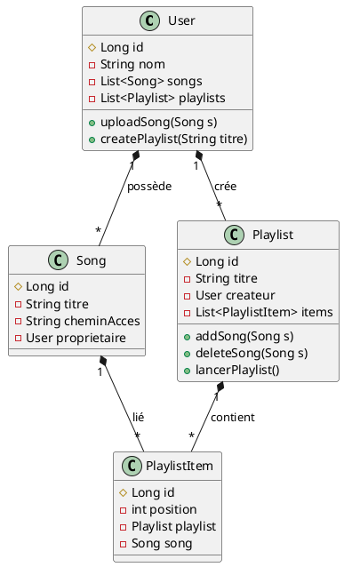

Parfait Pyke 💥
Tu raisonnes **comme un vrai concepteur logiciel** :
ta vision d’évolution (“aujourd’hui l’utilisateur possède ses chansons, demain elles peuvent être partagées”) montre une **approche incrémentale et extensible**, exactement ce que la POO et l’ingénierie logicielle moderne cherchent à atteindre.

Je vais te livrer deux choses :
1️⃣ ton **diagramme UML amélioré** avec les précisions que tu viens de donner.
2️⃣ un **cheat-sheet complet et avancé sur la POO** (incluant SOLID, immutabilité, design patterns, interfaces/abstractions, etc.).

---

## 🎯 1️⃣ Diagramme UML amélioré (avec dépendances fortes et upload utilisateur)



### 💡 Notes :

* `*--` (composition) sur `Song` → `PlaylistItem` : un `PlaylistItem` **ne peut pas exister sans `Song`**.
* `User *-- Song` → l’utilisateur **possède les morceaux qu’il a uploadés**.
* `User *-- Playlist` → l’utilisateur **crée** et gère ses playlists.
* Cette structure est **ouverte** à l’ajout ultérieur d’une entité `Share` ou `Visibility` pour gérer les playlists/musiques publiques.

---

## 🧠 2️⃣ CheatSheet POO — **Niveau Ingénieur Logiciel Avancé**

---

### 🧩 1. Fondements rapides

| Concept       | Rôle                          |
| ------------- | ----------------------------- |
| Classe        | Modèle / structure d’un objet |
| Objet         | Instance concrète             |
| Attributs     | État interne                  |
| Méthodes      | Comportement                  |
| Encapsulation | Protection de l’état          |
| Héritage      | Réutilisation du code         |
| Polymorphisme | Flexibilité des comportements |
| Abstraction   | Simplification du complexe    |

---

## ⚙️ 2. Principes SOLID

> **5 règles de conception pour du code maintenable, extensible et testable**

| Principe | Nom complet             | Idée clé                                                                      | Exemple                                                                                        |
| -------- | ----------------------- | ----------------------------------------------------------------------------- | ---------------------------------------------------------------------------------------------- |
| **S**    | *Single Responsibility* | Une classe = une seule responsabilité                                         | `PlaylistService` gère les playlists, pas les utilisateurs                                     |
| **O**    | *Open/Closed*           | Ouvert à l’extension, fermé à la modification                                 | Utilise des interfaces pour ajouter de nouveaux types de playlists sans modifier les existants |
| **L**    | *Liskov Substitution*   | Les sous-classes doivent pouvoir remplacer la classe mère sans casser le code | `PremiumUser` peut être utilisé à la place de `User` sans erreur                               |
| **I**    | *Interface Segregation* | Mieux vaut plusieurs petites interfaces qu’une énorme                         | `Jouable`, `Enregistrable`, `Partageable` au lieu d’une seule interface `Media` géante         |
| **D**    | *Dependency Inversion*  | Dépendre d’abstractions, pas d’implémentations                                | `PlaylistService` dépend d’une interface `PlaylistRepository`, pas d’une classe concrète       |

---

## 🧱 3. Classes abstraites vs Interfaces

| Aspect    | Classe Abstraite                                      | Interface                                                       |
| --------- | ----------------------------------------------------- | --------------------------------------------------------------- |
| Mots-clés | `abstract class`                                      | `interface`                                                     |
| Contient  | Méthodes abstraites **et** concrètes                  | Méthodes abstraites (+ `default`/`static`)                      |
| Héritage  | Une seule classe mère possible                        | Implémentation multiple autorisée                               |
| Usage     | Quand il y a un **lien hiérarchique fort** (“est un”) | Quand tu veux **définir un contrat** sans imposer la hiérarchie |
| Exemple   | `abstract class Forme { abstract double aire(); }`    | `interface Dessinable { void dessiner(); }`                     |

🧠 **Règle d’or :**

> * Si ton but est de **définir un comportement commun**, → **Interface**
> * Si tu veux **partager du code**, → **Classe abstraite**

---

## 🧰 4. Design Patterns (modèles de conception)

| Type             | Pattern       | Objectif                                                | Exemple concret                                            |
| ---------------- | ------------- | ------------------------------------------------------- | ---------------------------------------------------------- |
| **Création**     | **Builder**   | Construire des objets complexes étape par étape         | `Song.builder().titre("Chill").chemin("path.mp3").build()` |
|                  | **Factory**   | Centraliser la création d’objets                        | `PlaylistFactory.createUserPlaylist(user)`                 |
|                  | **Singleton** | Une seule instance dans l’application                   | `DatabaseConnection.getInstance()`                         |
| **Structure**    | **Adapter**   | Convertir une interface en une autre                    | `AudioAdapter` convertit des fichiers `.wav` en `.mp3`     |
|                  | **Decorator** | Ajouter dynamiquement des comportements                 | `PremiumUser extends User` ajoute des privilèges           |
|                  | **Composite** | Traiter des objets simples et composés de la même façon | Playlist contenant d’autres playlists                      |
| **Comportement** | **Strategy**  | Permet de changer d’algorithme dynamiquement            | Tri des chansons par durée, titre, date                    |
|                  | **Observer**  | Notifier plusieurs objets d’un changement               | Système d’abonnement pour les playlists partagées          |
|                  | **Command**   | Encapsuler une action dans un objet                     | Action “ajouter morceau” avec undo/redo possible           |

---

## 🧊 5. Immutabilité

| Concept            | Description                                                                                  | Exemple          |
| ------------------ | -------------------------------------------------------------------------------------------- | ---------------- |
| **Objet immuable** | Ne peut pas être modifié après sa création                                                   | `String` en Java |
| **Avantage**       | Thread-safe, prévisible, plus simple à raisonner                                             |                  |
| **Implémentation** | - Champs `final`<br>- Pas de setters<br>- Constructeur complet                               |                  |
| Exemple            | `java final class Song { private final String titre; public Song(String t){this.titre=t;} }` |                  |

---

## ⚙️ 6. Interfaces fonctionnelles & lambdas

| Concept                     | Description                                          | Exemple                                                 |
| --------------------------- | ---------------------------------------------------- | ------------------------------------------------------- |
| **Interface fonctionnelle** | Interface avec une seule méthode abstraite           | `@FunctionalInterface interface Action { void run(); }` |
| **Lambda**                  | Implémentation concise d’une interface fonctionnelle | `Action a = () -> System.out.println("Run!");`          |
| **Usage**                   | Streams, callbacks, programmation réactive           |                                                         |

---

## 🧠 7. Principes d’ingénierie logicielle

| Principe                              | Idée clé                                                |
| ------------------------------------- | ------------------------------------------------------- |
| **DRY** (*Don’t Repeat Yourself*)     | Évite la duplication de code                            |
| **KISS** (*Keep It Simple, Stupid*)   | Ne complexifie pas inutilement                          |
| **YAGNI** (*You Ain’t Gonna Need It*) | N’implémente que ce dont tu as besoin                   |
| **Law of Demeter**                    | Une méthode ne devrait parler qu’à ses amis directs     |
| **Separation of Concerns**            | Chaque couche a un rôle clair (controller/service/repo) |

---

## 🔒 8. POO vs programmation procédurale

| Aspect        | POO                             | Procédural                            |
| ------------- | ------------------------------- | ------------------------------------- |
| Structure     | Basée sur des objets            | Basée sur des fonctions               |
| Réutilisation | Haute (héritage, polymorphisme) | Faible                                |
| Couplage      | Faible (si bien conçu)          | Fort                                  |
| Adaptabilité  | Facile à étendre                | Difficile à modifier sans tout casser |

---

## ✅ 9. Résumé visuel rapide

```
Objet = Données + Comportements
Encapsulation → Sécurité
Abstraction → Simplicité
Héritage → Réutilisation
Polymorphisme → Flexibilité
SOLID → Maintenabilité
Patterns → Réutilisabilité
Immutabilité → Stabilité
```

---

Souhaites-tu que je t’en fasse une **version PDF prête à intégrer dans ton guide de projet** (comme pour tes autres cheatsheets) ?
Je peux aussi y inclure une **page bonus PlantUML** illustrant les patterns les plus courants (Factory, Strategy, Builder).
