# Cheatsheet PlantUML

---

## 🔑 Mots-clés & Utilisation

### 1. **Délimitation**
- `@startuml … @enduml`: début/fin du diagramme.

#### Code Exemple

```
@startuml
Alice ->Bob
@enduml
```

#### Résultat
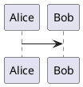


### 2. **Acteurs et Cas d'utilisations(Usecase)**

- `actor Nom` : Définit un acteur externe
- `usecase "Texte"` : Définit un cas d'utilisation.
- `rectangle "Nom"` : Encapsule un système

#### Code Exemple

```
@startuml
actor Client
rectangle "Serveur" {
    usecase "Créer une Playlist" as UC1
    usecase "Lire une playlist" as UC2
}
Client --> UC1
Client --> UC2

@enduml

```

#### Résultat

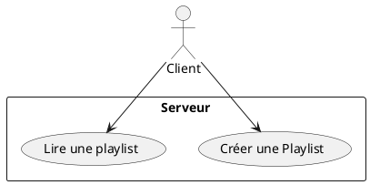

### 3. Classes

`class Nom { attributs + méthodes }` : définit une classe.

`-`= privé,`+` = public, `#` = protégé.

Relations :

`A -- B `(association)

`A <|-- B `(héritage)

`A ..> B `(dépendance)

#### Code Exemple

```
@startuml
class Playlist {
  - String titre
  - List<Morceau> morceaux
  + ajouterMorceau()
  + supprimerMorceau()
}

class Morceau {
  - String titre
  - String fichier
}

Playlist "1" -- "*" Morceau
@enduml

```

#### Résultat

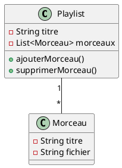

### 4. Séquence

- `A -> B: message` : envoie un message.
- `B --> A: réponse`: retour.
- `activate`/`deactivate`: durée de vie d'un projet

#### Code Exemple

```
@startuml
Client -> Serveur: GET /playlist
activate Serveur
Serveur -> DB: SELECT playlist
DB --> Serveur: données
deactivate Serveur
Serveur --> Client: JSON playlist
@enduml

```

#### Résultat

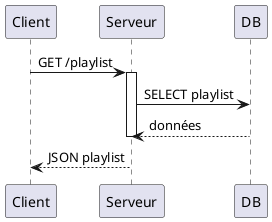


### 5. Activité (Diagramme de flux)

`start` / `stop` : début/fin.

`:action;` : activité.

`if (…) then (…) else (…) endif `: condition.

#### Code Exemple

```
@startuml
start
:Choisir chanson;
if (Fichier dispo localement?) then (oui)
  :Lire fichier local;
else (non)
  :Télécharger depuis serveur;
endif
:Lecture chanson;
stop
@enduml

```

#### Résultat

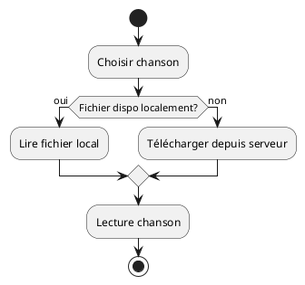

### 6. Composants / Déploiement

`component Nom` : composant logiciel.

`node Nom` : machine physique/serveur.

#### Code Exemple

```
@startuml
node "Serveur" {
  component "API REST"
  component "Base de données"
}

node "Client" {
  component "Web App"
}
@enduml

```

#### Résultat

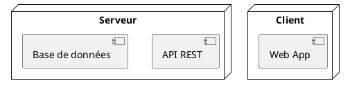

### 7. Objets

`object Nom { attributs }` : instance d’une classe.

#### Code Exemple

```
@startuml
object playlist1 {
  titre = "Workout Mix"
  nbMorceaux = 15
}
@enduml

```

#### Résultat

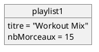

### 8. Décision simple (if/else)

`if (condition) then (texte) else (texte) endif` : crée un test conditionnel avec deux branches.

#### Code Exemple

```
@startuml
start
:Choisir chanson;
if (Fichier dispo localement?) then (oui)
  :Lire fichier local;
else (non)
  :Télécharger depuis serveur;
endif
:Lecture chanson;
stop
@enduml

```

#### Résultats


### 9. Boucle while

`while (condition) is (texte) … endwhile (texte) `: crée une boucle de type while.

#### Code Exemple

```
@startuml
@startuml
start
:Initialiser i=0;
while (i < taillePlaylist?) is (oui)
  :Lire morceau[i];
  :i = i + 1;
endwhile (non)
:Fin de lecture;
stop
@enduml

```

#### Résultats
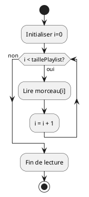

### 10. Boucle repeat (do … while)

`repeat … repeat while (condition)` : crée une boucle qui s’exécute au moins une fois.

#### Code Exemple

```
@startuml
start
repeat
  :Lire morceau courant;
  :Passer au suivant;
repeat while (Encore des morceaux?)
stop
@enduml

```

#### Résultat

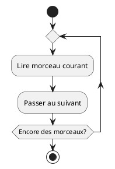

### 11. Alternative (if/else → alt)

`alt … else … end` : permet de modéliser un if/else.

#### Code Exemple
```
@startuml
Client -> Serveur: Demande playlist

alt Playlist existe
    Serveur --> Client: JSON Playlist
else Playlist introuvable
    Serveur --> Client: Erreur 404
end
@enduml

```
#### Résultat

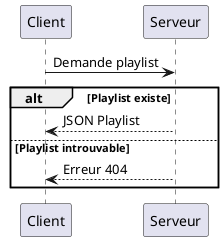
### 12. Option (if simple → opt)

`opt … end `: équivaut à un if sans else.

#### Code Exemple
```
@startuml
Client -> Serveur: Télécharger fichier

opt Fichier existe
    Serveur --> Client: Données audio
end
@enduml

```
#### Résultat

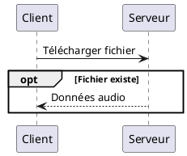
### 13. Boucle (loop)

`loop (condition)` : équivaut à un for ou while.


```
@startuml
Client -> Serveur: Demande lecture playlist

loop Pour chaque morceau
    Serveur -> Client: Envoi morceau
    Client -> Lecteur: Lire morceau
end
@enduml

```

#### Résultat
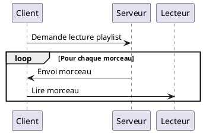


### 14. Parallèle (par)

`par … else … end` : plusieurs blocs qui s’exécutent en parallèle.

#### Code Exemple
```@startuml
Client -> Serveur: Start téléchargement

par Télécharger fichier audio
    Serveur --> Client: Données
else Lire morceau local
    Client -> Lecteur: Lire fichier
end
@enduml
```

#### Résultat

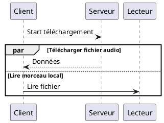