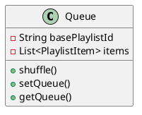
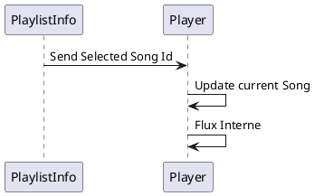
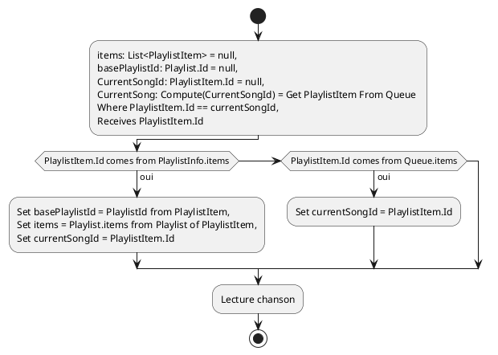

# Conception de Lecteur

## Classe File d'attente

---

``` plantuml
@startuml
Class Queue{
    - String basePlaylistId
    - List<PlaylistItem> items
    + shuffle()
    + setQueue()
    + getQueue()
}

Class Queue
@enduml

```
## Diagramme de Séquence

```plantuml
@startuml
PlaylistInfo -> Player: Send Selected Song Id
Player-> Player: Update current Song
Player -> Player: Flux Interne
@enduml
```
## Diagramme de Flux

```plantuml
@startuml
start
:items: List<PlaylistItem> = null, 
basePlaylistId: Playlist.Id = null,
CurrentSongId: PlaylistItem.Id = null, 
CurrentSong: Compute(CurrentSongId) = Get PlaylistItem From Queue 
Where PlaylistItem.Id == currentSongId,
Receives PlaylistItem.Id;
if (PlaylistItem.Id comes from PlaylistInfo.items) then (oui)
  :Set basePlaylistId = PlaylistId from PlaylistItem, 
  Set items = Playlist.items from Playlist of PlaylistItem,
  Set currentSongId = PlaylistItem.Id;

else if (PlaylistItem.Id comes from Queue.items) then (oui)
  :Set currentSongId = PlaylistItem.Id;
endif

:Lecture chanson;
stop
@enduml
```