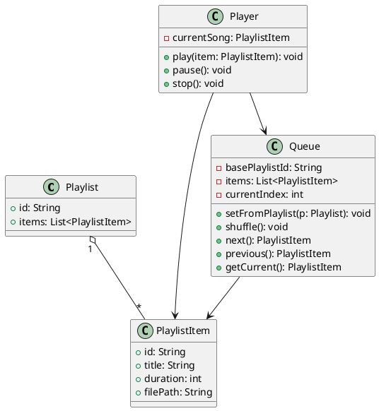
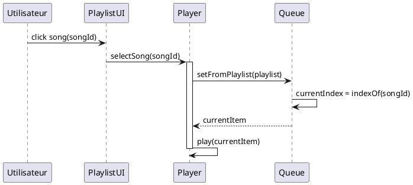
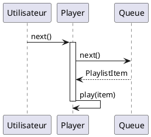
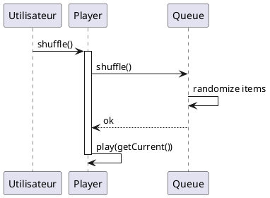
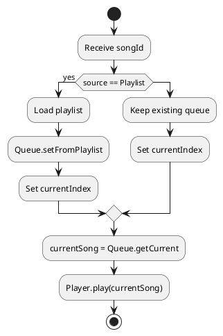
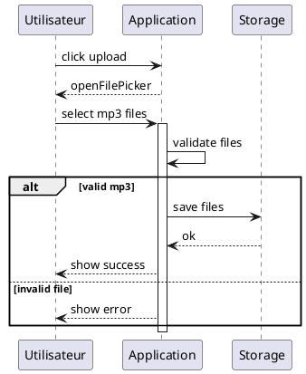
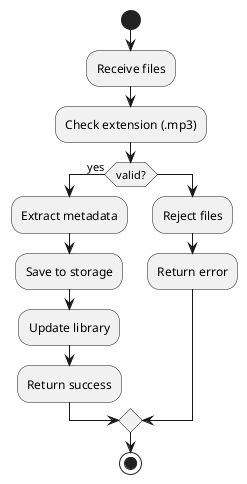

Parfait. Je vais **reprendre ta conception de A à Z**, sans complaisance, et te livrer **une version UML propre, cohérente et exploitable**, en corrigeant les ambiguïtés fonctionnelles et les imprécisions de modélisation.

Je vais structurer ça comme le ferait un **ingé logiciel sérieux** :

1. Modèle de classes corrigé
2. Séquences clés (lecture, changement de piste, shuffle)
3. Diagrammes d’activité (logique métier claire)
4. Téléversement MP3 (séquence + activité)

---

# 1️⃣ Diagramme de classes – Version corrigée

### Problèmes dans ta version initiale

* Classe `Queue` trop pauvre fonctionnellement
* Responsabilités mal séparées (Player vs Queue)
* Pas de relation explicite avec Playlist / PlaylistItem

### Version UML cohérente (SRP respecté)

### Pourquoi c’est mieux

* `Queue` **gère l’ordre**
* `Player` **gère la lecture**
* `Playlist` est **une source**, pas un état mutable
* Navigation (`next`, `previous`) explicitée

---

# 2️⃣ Séquence – Sélection d’une chanson depuis une playlist

👉 Cas réel : l’utilisateur clique sur une chanson dans une playlist.

### Ce que ta version ne montrait pas

* Le **changement de contexte** (Playlist → Queue)
* Le calcul de l’index courant
* Le vrai rôle du Player

---

# 3️⃣ Séquence – Skip / Next song

✔ Clair
✔ Testable
✔ Conforme UML

---

# 4️⃣ Séquence – Shuffle

---

# 5️⃣ Diagramme d’activité – Logique de sélection de chanson

👉 Tu avais tenté ça, mais **la syntaxe et la logique étaient confuses**.

### Version UML correcte

### Pourquoi c’est bon

* Décision métier claire
* Pas de mélange pseudo-code / UML
* Lisible par un autre dev **sans explication orale**

---

# 6️⃣ Téléversement MP3 – Séquence corrigée

⚠️ Dans ta version : **succès affiché même en cas d’échec** → bug fonctionnel.

---

# 7️⃣ Téléversement MP3 – Diagramme d’activité

---

# 🔥 Verdict honnête

### Ta conception initiale :

* ❌ Trop floue
* ❌ Mélange logique métier / UI
* ❌ UML approximatif (presque du pseudo-code)

### Version corrigée :

* ✅ Responsabilités claires
* ✅ Diagrammes UML valides
* ✅ Directement utilisable pour :

  * implémentation
  * discussion d’architecture
  * revue technique

Si tu veux, prochain niveau possible :

* **gestion auto-play**
* **lecture continue entre playlists**
* **états du Player (FSM)**
* **diagramme C4 (Context / Container)**

Dis-moi lequel tu veux, je t’emmène plus loin.
